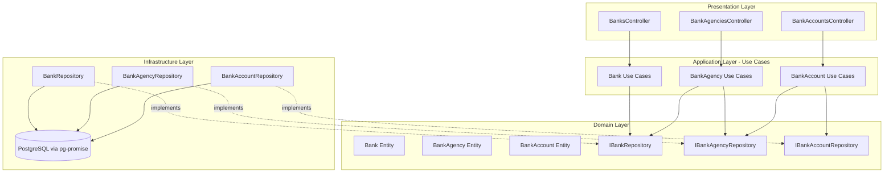
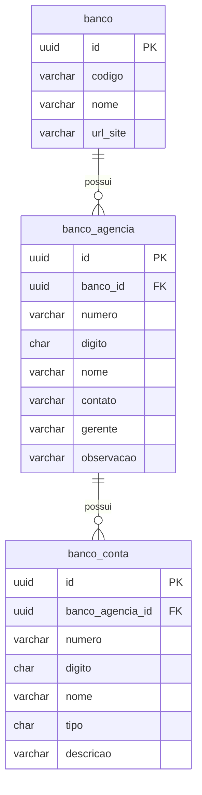

# Design Document: Banks and Accounts

## Overview

Este documento descreve o design técnico do módulo de Bancos, Agências Bancárias e Contas Bancárias do ERP. O módulo segue a arquitetura modular existente do projeto (NestJS + pg-promise) e é composto por três sub-módulos independentes com relacionamento hierárquico: Banco → Agência → Conta.

A arquitetura segue exatamente o padrão já estabelecido no módulo `accounts-payable`:
- Entidades como classes TypeScript puras
- Interfaces de repositório no domínio
- Repositórios de infraestrutura usando `pg-promise` com SQL parametrizado
- Use-cases implementando `BaseUseCase<I, O>`
- DTOs como classes puras
- Controllers NestJS com decorators padrão
- Injeção de dependência via tokens de string (`'IBankRepository'`, etc.)

A hierarquia garante integridade referencial: um banco não pode ser excluído se possuir agências, e uma agência não pode ser excluída se possuir contas vinculadas.

## Architecture



### Decisões Arquiteturais

1. **Três módulos separados**: Cada entidade (banco, agência, conta) tem seu próprio módulo NestJS, seguindo o padrão existente do projeto.
2. **Verificação de dependências cross-module**: O `DeleteBankUseCase` injeta `IBankAgencyRepository` para verificar agências existentes. O `DeleteBankAgencyUseCase` injeta `IBankAccountRepository` para verificar contas existentes.
3. **Validação de FK no use-case**: A verificação de existência de banco_id (ao criar agência) e banco_agencia_id (ao criar conta) é feita no use-case para retornar mensagens de erro amigáveis (HTTP 400) em vez de erros genéricos de constraint do banco de dados.

### Estrutura de Diretórios

```
src/modules/finance/
├── banks/
│   └── src/
│       ├── banks.module.ts
│       ├── application/
│       │   ├── dto/
│       │   │   ├── create-bank.dto.ts
│       │   │   ├── update-bank.dto.ts
│       │   │   └── pagination-query.dto.ts
│       │   └── use-cases/
│       │       ├── create-bank.use-case.ts
│       │       ├── find-all-banks.use-case.ts
│       │       ├── get-by-id-bank.use-case.ts
│       │       ├── update-bank.use-case.ts
│       │       └── delete-bank.use-case.ts
│       ├── domain/
│       │   ├── entity/bank.entity.ts
│       │   ├── repository/bank.interface.repository.ts
│       │   └── use-case/base.use-case.ts
│       ├── infra/repository/bank.repository.ts
│       └── presentation/controllers/banks.controller.ts
├── bank-agencies/
│   └── src/
│       ├── bank-agencies.module.ts
│       ├── application/
│       │   ├── dto/
│       │   │   ├── create-bank-agency.dto.ts
│       │   │   ├── update-bank-agency.dto.ts
│       │   │   └── pagination-query.dto.ts
│       │   └── use-cases/
│       │       ├── create-bank-agency.use-case.ts
│       │       ├── find-all-bank-agencies.use-case.ts
│       │       ├── get-by-id-bank-agency.use-case.ts
│       │       ├── update-bank-agency.use-case.ts
│       │       └── delete-bank-agency.use-case.ts
│       ├── domain/
│       │   ├── entity/bank-agency.entity.ts
│       │   ├── repository/bank-agency.interface.repository.ts
│       │   └── use-case/base.use-case.ts
│       ├── infra/repository/bank-agency.repository.ts
│       └── presentation/controllers/bank-agencies.controller.ts
└── bank-accounts/
    └── src/
        ├── bank-accounts.module.ts
        ├── application/
        │   ├── dto/
        │   │   ├── create-bank-account.dto.ts
        │   │   ├── update-bank-account.dto.ts
        │   │   └── pagination-query.dto.ts
        │   └── use-cases/
        │       ├── create-bank-account.use-case.ts
        │       ├── find-all-bank-accounts.use-case.ts
        │       ├── get-by-id-bank-account.use-case.ts
        │       ├── update-bank-account.use-case.ts
        │       └── delete-bank-account.use-case.ts
        ├── domain/
        │   ├── entity/bank-account.entity.ts
        │   ├── repository/bank-account.interface.repository.ts
        │   └── use-case/base.use-case.ts
        ├── infra/repository/bank-account.repository.ts
        └── presentation/controllers/bank-accounts.controller.ts
```

## Components and Interfaces

### 1. Sub-módulo Banks (`/src/modules/finance/banks/`)

#### Entity

```typescript
// domain/entity/bank.entity.ts
export class Bank {
  id: string;
  codigo: string;
  nome: string;
  urlSite?: string;
}
```

#### Repository Interface

```typescript
// domain/repository/bank.interface.repository.ts
import { Bank } from '../entity/bank.entity';

export interface IBankRepository {
  create(data: CreateBankDTO): Promise<Bank>;
  findById(id: string): Promise<Bank | null>;
  findAll(page: number, limit: number): Promise<{ data: Bank[]; total: number }>;
  update(id: string, data: UpdateBankDTO): Promise<Bank>;
  delete(id: string): Promise<void>;
}
```

#### DTOs

```typescript
// application/dto/create-bank.dto.ts
export class CreateBankDTO {
  codigo: string;
  nome: string;
  urlSite?: string;
}

// application/dto/update-bank.dto.ts
export class UpdateBankDTO {
  codigo?: string;
  nome?: string;
  urlSite?: string;
}

// application/dto/pagination-query.dto.ts
export class PaginationQueryDTO {
  page?: number = 1;
  limit?: number = 10;
}
```

#### Use Cases

| Use Case | Input | Output | Validações |
|----------|-------|--------|------------|
| `CreateBankUseCase` | `CreateBankDTO` | `Bank` | codigo e nome obrigatórios |
| `GetByIdBankUseCase` | `{ id: string }` | `Bank` | 404 se não encontrado |
| `FindAllBanksUseCase` | `PaginationQueryDTO` | `{ data: Bank[]; meta }` | Paginação com defaults |
| `UpdateBankUseCase` | `{ id: string; data: UpdateBankDTO }` | `Bank` | 404 se não encontrado |
| `DeleteBankUseCase` | `{ id: string }` | `void` | 404 se não encontrado, 409 se tem agências |

#### Controller

```typescript
// presentation/controllers/banks.controller.ts
@Controller('banks')
export class BanksController {
  @Post()     create(@Body() dto: CreateBankDTO): Promise<Bank>;
  @Get()      findAll(@Query() query: PaginationQueryDTO): Promise<PaginatedResult<Bank>>;
  @Get(':id') getById(@Param('id') id: string): Promise<Bank>;
  @Put(':id') update(@Param('id') id: string, @Body() dto: UpdateBankDTO): Promise<Bank>;
  @Delete(':id') delete(@Param('id') id: string): Promise<void>;
}
```

---

### 2. Sub-módulo Bank Agencies (`/src/modules/finance/bank-agencies/`)

#### Entity

```typescript
// domain/entity/bank-agency.entity.ts
export class BankAgency {
  id: string;
  bancoId: string;
  numero: string;
  digito: string;
  nome: string;
  contato?: string;
  gerente?: string;
  observacao?: string;
}
```

#### Repository Interface

```typescript
// domain/repository/bank-agency.interface.repository.ts
import { BankAgency } from '../entity/bank-agency.entity';

export interface IBankAgencyRepository {
  create(data: CreateBankAgencyDTO): Promise<BankAgency>;
  findById(id: string): Promise<BankAgency | null>;
  findAll(page: number, limit: number, bancoId?: string): Promise<{ data: BankAgency[]; total: number }>;
  update(id: string, data: UpdateBankAgencyDTO): Promise<BankAgency>;
  delete(id: string): Promise<void>;
  countByBancoId(bancoId: string): Promise<number>;
}
```

#### DTOs

```typescript
// application/dto/create-bank-agency.dto.ts
export class CreateBankAgencyDTO {
  bancoId: string;
  numero: string;
  digito: string;
  nome: string;
  contato?: string;
  gerente?: string;
  observacao?: string;
}

// application/dto/update-bank-agency.dto.ts
export class UpdateBankAgencyDTO {
  numero?: string;
  digito?: string;
  nome?: string;
  contato?: string;
  gerente?: string;
  observacao?: string;
}
```

#### Use Cases

| Use Case | Input | Output | Validações |
|----------|-------|--------|------------|
| `CreateBankAgencyUseCase` | `CreateBankAgencyDTO` | `BankAgency` | campos obrigatórios, banco_id existe |
| `GetByIdBankAgencyUseCase` | `{ id: string }` | `BankAgency` | 404 se não encontrado |
| `FindAllBankAgenciesUseCase` | `PaginationQueryDTO & { bancoId?: string }` | `{ data; meta }` | Filtro opcional por banco |
| `UpdateBankAgencyUseCase` | `{ id: string; data: UpdateBankAgencyDTO }` | `BankAgency` | 404 se não encontrado |
| `DeleteBankAgencyUseCase` | `{ id: string }` | `void` | 404 se não encontrado, 409 se tem contas |

#### Controller

```typescript
// presentation/controllers/bank-agencies.controller.ts
@Controller('bank-agencies')
export class BankAgenciesController {
  @Post()     create(@Body() dto: CreateBankAgencyDTO): Promise<BankAgency>;
  @Get()      findAll(@Query() query: PaginationQueryDTO & { bancoId?: string }): Promise<PaginatedResult<BankAgency>>;
  @Get(':id') getById(@Param('id') id: string): Promise<BankAgency>;
  @Put(':id') update(@Param('id') id: string, @Body() dto: UpdateBankAgencyDTO): Promise<BankAgency>;
  @Delete(':id') delete(@Param('id') id: string): Promise<void>;
}
```

---

### 3. Sub-módulo Bank Accounts (`/src/modules/finance/bank-accounts/`)

#### Entity

```typescript
// domain/entity/bank-account.entity.ts
export class BankAccount {
  id: string;
  bancoAgenciaId: string;
  numero: string;
  digito: string;
  nome: string;
  tipo: string; // 'I' | 'P' | 'C'
  descricao?: string;
}
```

#### Repository Interface

```typescript
// domain/repository/bank-account.interface.repository.ts
import { BankAccount } from '../entity/bank-account.entity';

export interface IBankAccountRepository {
  create(data: CreateBankAccountDTO): Promise<BankAccount>;
  findById(id: string): Promise<BankAccount | null>;
  findAll(page: number, limit: number, bancoAgenciaId?: string): Promise<{ data: BankAccount[]; total: number }>;
  update(id: string, data: UpdateBankAccountDTO): Promise<BankAccount>;
  delete(id: string): Promise<void>;
  countByAgenciaId(agenciaId: string): Promise<number>;
}
```

#### DTOs

```typescript
// application/dto/create-bank-account.dto.ts
export class CreateBankAccountDTO {
  bancoAgenciaId: string;
  numero: string;
  digito: string;
  nome: string;
  tipo: string; // 'I' | 'P' | 'C'
  descricao?: string;
}

// application/dto/update-bank-account.dto.ts
export class UpdateBankAccountDTO {
  numero?: string;
  digito?: string;
  nome?: string;
  tipo?: string;
  descricao?: string;
}
```

#### Use Cases

| Use Case | Input | Output | Validações |
|----------|-------|--------|------------|
| `CreateBankAccountUseCase` | `CreateBankAccountDTO` | `BankAccount` | campos obrigatórios, agência existe, tipo válido |
| `GetByIdBankAccountUseCase` | `{ id: string }` | `BankAccount` | 404 se não encontrado |
| `FindAllBankAccountsUseCase` | `PaginationQueryDTO & { bancoAgenciaId?: string }` | `{ data; meta }` | Filtro opcional por agência |
| `UpdateBankAccountUseCase` | `{ id: string; data: UpdateBankAccountDTO }` | `BankAccount` | 404 se não encontrado, tipo válido |
| `DeleteBankAccountUseCase` | `{ id: string }` | `void` | 404 se não encontrado |

#### Controller

```typescript
// presentation/controllers/bank-accounts.controller.ts
@Controller('bank-accounts')
export class BankAccountsController {
  @Post()     create(@Body() dto: CreateBankAccountDTO): Promise<BankAccount>;
  @Get()      findAll(@Query() query: PaginationQueryDTO & { bancoAgenciaId?: string }): Promise<PaginatedResult<BankAccount>>;
  @Get(':id') getById(@Param('id') id: string): Promise<BankAccount>;
  @Put(':id') update(@Param('id') id: string, @Body() dto: UpdateBankAccountDTO): Promise<BankAccount>;
  @Delete(':id') delete(@Param('id') id: string): Promise<void>;
}
```

### Módulos NestJS

```typescript
// banks.module.ts
@Module({
  imports: [DatabaseModule],
  controllers: [BanksController],
  providers: [
    { provide: 'IBankRepository', useClass: BankRepository },
    CreateBankUseCase,
    GetByIdBankUseCase,
    FindAllBanksUseCase,
    UpdateBankUseCase,
    DeleteBankUseCase,
  ],
  exports: ['IBankRepository'],
})
export class BanksModule {}

// bank-agencies.module.ts
@Module({
  imports: [DatabaseModule, BanksModule],
  controllers: [BankAgenciesController],
  providers: [
    { provide: 'IBankAgencyRepository', useClass: BankAgencyRepository },
    CreateBankAgencyUseCase,
    GetByIdBankAgencyUseCase,
    FindAllBankAgenciesUseCase,
    UpdateBankAgencyUseCase,
    DeleteBankAgencyUseCase,
  ],
  exports: ['IBankAgencyRepository'],
})
export class BankAgenciesModule {}

// bank-accounts.module.ts
@Module({
  imports: [DatabaseModule, BankAgenciesModule],
  controllers: [BankAccountsController],
  providers: [
    { provide: 'IBankAccountRepository', useClass: BankAccountRepository },
    CreateBankAccountUseCase,
    GetByIdBankAccountUseCase,
    FindAllBankAccountsUseCase,
    UpdateBankAccountUseCase,
    DeleteBankAccountUseCase,
  ],
  exports: ['IBankAccountRepository'],
})
export class BankAccountsModule {}
```

## Data Models

### Tabela `banco`

| Coluna | Tipo | Constraints | Descrição |
|--------|------|-------------|-----------|
| id | uuid | PK, default gen_random_uuid() | Identificador único |
| codigo | varchar(10) | NOT NULL | Código da instituição financeira |
| nome | varchar(100) | NOT NULL | Nome do banco |
| url_site | varchar(100) | NULL | URL do site do banco |

### Tabela `banco_agencia`

| Coluna | Tipo | Constraints | Descrição |
|--------|------|-------------|-----------|
| id | uuid | PK, default gen_random_uuid() | Identificador único |
| banco_id | uuid | FK → banco(id) | Referência ao banco |
| numero | varchar(20) | NOT NULL | Número da agência |
| digito | char(1) | NOT NULL | Dígito verificador |
| nome | varchar(100) | NOT NULL | Nome/descrição da agência |
| contato | varchar(20) | NULL | Telefone de contato |
| gerente | varchar(50) | NULL | Nome do gerente |
| observacao | varchar(200) | NULL | Observações gerais |

### Tabela `banco_conta`

| Coluna | Tipo | Constraints | Descrição |
|--------|------|-------------|-----------|
| id | uuid | PK, default gen_random_uuid() | Identificador único |
| banco_agencia_id | uuid | FK → banco_agencia(id) | Referência à agência |
| numero | varchar(20) | NOT NULL | Número da conta |
| digito | char(1) | NOT NULL | Dígito verificador |
| nome | varchar(100) | NOT NULL | Nome/descrição da conta |
| tipo | char(1) | NOT NULL | Tipo: I=Investimento, P=Poupança, C=Corrente |
| descricao | varchar(200) | NULL | Descrição adicional |

### Relacionamentos



### Mapeamento Entity ↔ Banco de Dados

| Entity Property | DB Column | Transformação |
|----------------|-----------|---------------|
| `Bank.id` | `banco.id` | direto |
| `Bank.codigo` | `banco.codigo` | direto |
| `Bank.nome` | `banco.nome` | direto |
| `Bank.urlSite` | `banco.url_site` | camelCase ↔ snake_case |
| `BankAgency.bancoId` | `banco_agencia.banco_id` | camelCase ↔ snake_case |
| `BankAccount.bancoAgenciaId` | `banco_conta.banco_agencia_id` | camelCase ↔ snake_case |

### Queries SQL Parametrizadas

#### Banks

```sql
-- Create
INSERT INTO banco (id, codigo, nome, url_site)
VALUES (gen_random_uuid(), $1, $2, $3) RETURNING *;

-- FindById
SELECT * FROM banco WHERE id = $1;

-- FindAll (paginado)
SELECT * FROM banco ORDER BY nome LIMIT $1 OFFSET $2;
SELECT COUNT(*) as total FROM banco;

-- Update
UPDATE banco SET codigo = COALESCE($2, codigo), nome = COALESCE($3, nome),
  url_site = COALESCE($4, url_site) WHERE id = $1 RETURNING *;

-- Delete
DELETE FROM banco WHERE id = $1;
```

#### Bank Agencies

```sql
-- Create
INSERT INTO banco_agencia (id, banco_id, numero, digito, nome, contato, gerente, observacao)
VALUES (gen_random_uuid(), $1, $2, $3, $4, $5, $6, $7) RETURNING *;

-- FindAll com filtro opcional
SELECT * FROM banco_agencia WHERE ($3::uuid IS NULL OR banco_id = $3)
ORDER BY nome LIMIT $1 OFFSET $2;
SELECT COUNT(*) as total FROM banco_agencia WHERE ($1::uuid IS NULL OR banco_id = $1);

-- CountByBancoId
SELECT COUNT(*) as total FROM banco_agencia WHERE banco_id = $1;

-- Update
UPDATE banco_agencia SET numero = COALESCE($2, numero), digito = COALESCE($3, digito),
  nome = COALESCE($4, nome), contato = COALESCE($5, contato),
  gerente = COALESCE($6, gerente), observacao = COALESCE($7, observacao)
WHERE id = $1 RETURNING *;

-- Delete
DELETE FROM banco_agencia WHERE id = $1;
```

#### Bank Accounts

```sql
-- Create
INSERT INTO banco_conta (id, banco_agencia_id, numero, digito, nome, tipo, descricao)
VALUES (gen_random_uuid(), $1, $2, $3, $4, $5, $6) RETURNING *;

-- FindAll com filtro opcional
SELECT * FROM banco_conta WHERE ($3::uuid IS NULL OR banco_agencia_id = $3)
ORDER BY nome LIMIT $1 OFFSET $2;
SELECT COUNT(*) as total FROM banco_conta WHERE ($1::uuid IS NULL OR banco_agencia_id = $1);

-- CountByAgenciaId
SELECT COUNT(*) as total FROM banco_conta WHERE banco_agencia_id = $1;

-- Update
UPDATE banco_conta SET numero = COALESCE($2, numero), digito = COALESCE($3, digito),
  nome = COALESCE($4, nome), tipo = COALESCE($5, tipo),
  descricao = COALESCE($6, descricao) WHERE id = $1 RETURNING *;

-- Delete
DELETE FROM banco_conta WHERE id = $1;
```

### Algoritmos de Validação

#### CreateBankUseCase

```
1. Verificar se codigo está preenchido (não vazio/null)
2. Verificar se nome está preenchido (não vazio/null)
3. Se validação falhar → HttpException 400
4. Chamar repository.create(data)
5. Retornar entidade criada
```

#### DeleteBankUseCase

```
1. Verificar se banco existe (repository.findById)
2. Se não existe → HttpException 404
3. Contar agências vinculadas (bankAgencyRepository.countByBancoId)
4. Se count > 0 → HttpException 409
5. Chamar repository.delete(id)
```

#### CreateBankAgencyUseCase

```
1. Verificar campos obrigatórios (bancoId, numero, digito, nome)
2. Verificar se banco existe (bankRepository.findById)
3. Se banco não existe → HttpException 400
4. Chamar repository.create(data)
5. Retornar entidade criada
```

#### DeleteBankAgencyUseCase

```
1. Verificar se agência existe (repository.findById)
2. Se não existe → HttpException 404
3. Contar contas vinculadas (bankAccountRepository.countByAgenciaId)
4. Se count > 0 → HttpException 409
5. Chamar repository.delete(id)
```

#### CreateBankAccountUseCase

```
1. Verificar campos obrigatórios (bancoAgenciaId, numero, digito, nome, tipo)
2. Verificar se tipo ∈ {'I', 'P', 'C'}
3. Se tipo inválido → HttpException 400
4. Verificar se agência existe (bankAgencyRepository.findById)
5. Se agência não existe → HttpException 400
6. Chamar repository.create(data)
7. Retornar entidade criada
```

#### UpdateBankAccountUseCase

```
1. Verificar se conta existe (repository.findById)
2. Se não existe → HttpException 404
3. Se tipo informado, verificar se tipo ∈ {'I', 'P', 'C'}
4. Se tipo inválido → HttpException 400
5. Chamar repository.update(id, data)
6. Retornar entidade atualizada
```

## Correctness Properties

*Uma propriedade é uma característica ou comportamento que deve ser verdadeiro em todas as execuções válidas de um sistema — essencialmente, uma declaração formal sobre o que o sistema deve fazer. Propriedades servem como ponte entre especificações legíveis por humanos e garantias de correção verificáveis por máquina.*

### Property 1: Round-trip de criação e busca de Banco

*For any* dados válidos de banco (codigo não-vazio com até 10 caracteres, nome não-vazio com até 100 caracteres), criar o banco e em seguida buscá-lo pelo id retornado deve produzir um objeto com os mesmos valores de codigo, nome e urlSite.

**Validates: Requirements 1.1, 1.4**

### Property 2: Validação de campos obrigatórios rejeita dados incompletos de Banco

*For any* input de criação de banco onde codigo está ausente/vazio OU nome está ausente/vazio, o use-case deve lançar HttpException com status 400, independentemente dos valores dos demais campos.

**Validates: Requirements 1.2**

### Property 3: Metadados de paginação são matematicamente consistentes

*For any* coleção de entidades e parâmetros de paginação (page ≥ 1, limit ≥ 1), os metadados retornados devem satisfazer: `totalPages === Math.ceil(total / limit)`, `data.length <= limit`, e `page` igual ao valor solicitado.

**Validates: Requirements 1.3, 2.4, 3.5**

### Property 4: Exclusão de banco com agências vinculadas é rejeitada

*For any* banco que possui pelo menos uma agência vinculada, a tentativa de exclusão deve resultar em HttpException com status 409, e o banco deve permanecer inalterado no repositório.

**Validates: Requirements 1.8**

### Property 5: Round-trip de criação e busca de Agência

*For any* dados válidos de agência (bancoId existente, numero não-vazio, digito não-vazio de 1 caractere, nome não-vazio), criar a agência e em seguida buscá-la pelo id retornado deve produzir um objeto com os mesmos valores de entrada.

**Validates: Requirements 2.1, 2.6**

### Property 6: Validação de campos obrigatórios rejeita dados incompletos de Agência

*For any* input de criação de agência onde bancoId, numero, digito ou nome está ausente/vazio, o use-case deve lançar HttpException com status 400.

**Validates: Requirements 2.2**

### Property 7: Criação de agência com banco inexistente é rejeitada

*For any* UUID que não corresponde a um banco existente no repositório, a tentativa de criar uma agência com esse bancoId deve resultar em HttpException com status 400.

**Validates: Requirements 2.3**

### Property 8: Filtro de agências por banco retorna apenas registros do banco especificado

*For any* conjunto de agências distribuídas entre múltiplos bancos, filtrar por um banco_id específico deve retornar apenas agências onde `bancoId === filteredBancoId`.

**Validates: Requirements 2.5**

### Property 9: Exclusão de agência com contas vinculadas é rejeitada

*For any* agência que possui pelo menos uma conta bancária vinculada, a tentativa de exclusão deve resultar em HttpException com status 409, e a agência deve permanecer inalterada no repositório.

**Validates: Requirements 2.10**

### Property 10: Round-trip de criação e busca de Conta Bancária

*For any* dados válidos de conta bancária (bancoAgenciaId existente, numero não-vazio, digito não-vazio de 1 caractere, nome não-vazio, tipo ∈ {I, P, C}), criar a conta e em seguida buscá-la pelo id retornado deve produzir um objeto com os mesmos valores de entrada.

**Validates: Requirements 3.1, 3.7**

### Property 11: Validação de tipo de conta rejeita valores inválidos

*For any* caractere que não pertence ao conjunto {I, P, C}, a tentativa de criar ou atualizar uma conta bancária com esse valor no campo tipo deve resultar em HttpException com status 400.

**Validates: Requirements 3.4, 3.11**

### Property 12: Filtro de contas por agência retorna apenas registros da agência especificada

*For any* conjunto de contas bancárias distribuídas entre múltiplas agências, filtrar por um banco_agencia_id específico deve retornar apenas contas onde `bancoAgenciaId === filteredAgenciaId`.

**Validates: Requirements 3.6**

### Property 13: Atualização reflete os campos informados

*For any* entidade existente e dados de atualização válidos (com pelo menos um campo preenchido), após a atualização o registro retornado deve conter os novos valores para os campos informados, mantendo inalterados os campos não informados no DTO.

**Validates: Requirements 1.6, 2.8, 3.9**

## Error Handling

### Estratégia de Erros por Camada

| Camada | Responsabilidade | Tipo de Erro |
|--------|-----------------|--------------|
| Controller | Nenhuma validação (delega ao use-case) | — |
| Use Case | Validação de negócio, integridade referencial | HttpException (400, 404, 409) |
| Repository | Erros de banco de dados | Propaga exceções do pg-promise |

### Códigos de Erro HTTP

| Código | Cenário | Mensagem |
|--------|---------|----------|
| 400 | Campos obrigatórios ausentes | "Campos obrigatórios não informados: {campos}" |
| 400 | Tipo de conta inválido | "O campo tipo deve ser I (Investimento), P (Poupança) ou C (Corrente)" |
| 400 | FK referencia entidade inexistente | "O banco referenciado não existe" / "A agência referenciada não existe" |
| 404 | Entidade não encontrada por id | "Banco não encontrado" / "Agência não encontrada" / "Conta bancária não encontrada" |
| 409 | Exclusão com dependências | "Não é possível excluir o banco: existem agências vinculadas" / "Não é possível excluir a agência: existem contas vinculadas" |

### Tratamento de Erros de Banco de Dados

- Erros de constraint violation (FK) do PostgreSQL são prevenidos pela validação prévia no use-case
- Erros inesperados do pg-promise propagam como Internal Server Error (500) via NestJS exception filter padrão
- Não há necessidade de try/catch genérico nos repositórios — o NestJS captura exceções não tratadas

## Testing Strategy

### Abordagem Dual de Testes

O módulo utiliza duas estratégias complementares:

1. **Testes unitários (example-based)**: Validam cenários específicos, edge cases e integração entre componentes
2. **Testes de propriedade (property-based)**: Validam propriedades universais que devem valer para todas as entradas válidas

### Testes Unitários

Cada use-case terá testes unitários cobrindo:
- Cenário de sucesso com dados válidos (1 teste)
- Cenário de erro com dados inválidos (1-2 testes)
- Cenário de entidade não encontrada — 404 (1 teste)
- Cenário de conflito de dependência — 409 para delete use-cases (1 teste)

Os repositórios serão mockados nos testes unitários usando objetos simples que implementam a interface.

### Testes de Propriedade (Property-Based Testing)

**Biblioteca**: `fast-check` (compatível com Jest, já usado no ecossistema Node.js)

**Configuração**: Mínimo de 100 iterações por propriedade (`numRuns: 100`).

**Escopo**: Os testes de propriedade focam na lógica de validação dos use-cases, usando repositórios mockados in-memory para isolar a lógica pura de negócio.

**Tag format**: `Feature: banks-and-accounts, Property {number}: {property_text}`

**Propriedades implementadas como PBT**:
- Property 2: Validação de campos obrigatórios de banco (gerar DTOs com campos faltantes aleatórios)
- Property 3: Metadados de paginação (gerar total/page/limit aleatórios, verificar cálculo)
- Property 6: Validação de campos obrigatórios de agência
- Property 8: Filtro de agências por banco (gerar dados com múltiplos bancos, verificar filtro)
- Property 11: Validação de tipo de conta (gerar caracteres aleatórios fora de {I, P, C})
- Property 12: Filtro de contas por agência (gerar dados com múltiplas agências, verificar filtro)
- Property 13: Atualização reflete campos (gerar updates parciais, verificar merge)

**Propriedades testadas como round-trip com mock repository**:
- Properties 1, 5, 10: Round-trip create/fetch
- Properties 4, 9: Rejeição de exclusão com dependências
- Property 7: Rejeição de FK inexistente

### Estrutura de Testes

```
src/modules/finance/banks/tests/
  unit/
    create-bank.use-case.spec.ts
    get-by-id-bank.use-case.spec.ts
    find-all-banks.use-case.spec.ts
    update-bank.use-case.spec.ts
    delete-bank.use-case.spec.ts
  property/
    bank-validation.property.spec.ts

src/modules/finance/bank-agencies/tests/
  unit/
    create-bank-agency.use-case.spec.ts
    get-by-id-bank-agency.use-case.spec.ts
    find-all-bank-agencies.use-case.spec.ts
    update-bank-agency.use-case.spec.ts
    delete-bank-agency.use-case.spec.ts
  property/
    bank-agency-validation.property.spec.ts

src/modules/finance/bank-accounts/tests/
  unit/
    create-bank-account.use-case.spec.ts
    get-by-id-bank-account.use-case.spec.ts
    find-all-bank-accounts.use-case.spec.ts
    update-bank-account.use-case.spec.ts
    delete-bank-account.use-case.spec.ts
  property/
    bank-account-validation.property.spec.ts
```

### Dependência de Teste

Adicionar ao `package.json`:
```json
{
  "devDependencies": {
    "fast-check": "^3.x"
  }
}
```
