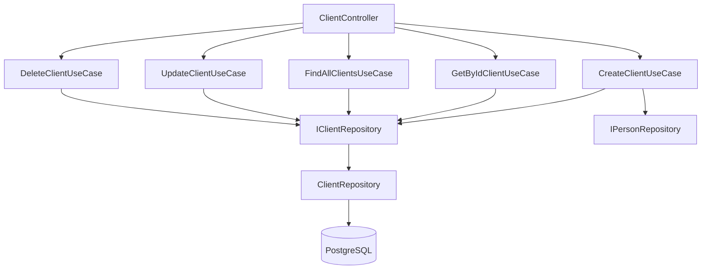

# Client Module — Design

## Overview

O módulo Client implementa o CRUD completo de clientes seguindo Clean Architecture (domain → application → infra → presentation). Utiliza NestJS como framework, pg-promise para acesso ao PostgreSQL com queries SQL raw, e segue os mesmos padrões do módulo Employee.

## Architecture



## Module Structure

```
src/modules/person/client/src/
  ├── domain/
  │   ├── entity/
  │   │   └── client.entity.ts
  │   ├── repository/
  │   │   └── client.interface.repository.ts
  │   └── use-case/
  │       └── base.use-case.ts
  │
  ├── application/
  │   ├── dto/
  │   │   ├── create-client.dto.ts
  │   │   ├── update-client.dto.ts
  │   │   └── pagination-query.dto.ts
  │   └── use-cases/
  │       ├── create-client.use-case.ts
  │       ├── get-by-id-client.use-case.ts
  │       ├── find-all-clients.use-case.ts
  │       ├── update-client.use-case.ts
  │       └── delete-client.use-case.ts
  │
  ├── infra/
  │   └── repository/
  │       └── client.repository.ts
  │
  ├── presentation/
  │   └── controllers/
  │       └── client.controller.ts
  │
  └── client.module.ts
```

## Components and Interfaces

### IClientRepository

```typescript
export interface IClientRepository {
  create(data: any, transaction?: any): Promise<Client>;
  findById(id: string): Promise<any | null>;
  findAll(page: number, limit: number): Promise<{ data: any[]; total: number }>;
  update(id: string, data: any): Promise<any>;
  delete(id: string): Promise<void>;
}
```

### Use Cases

#### CreateClientUseCase
Padrão transacional existente — cria Pessoa, dados específicos (física/jurídica), contatos, endereços e registro em cliente dentro de uma transação única.

#### GetByIdClientUseCase
Consulta o cliente por ID com JOIN na tabela pessoa. Lança NotFoundException se não encontrado.

#### FindAllClientsUseCase
Lista clientes ativos com paginação. Retorna dados + metadados de paginação.

```typescript
interface PaginatedResult<T> {
  data: T[];
  meta: {
    total: number;
    page: number;
    limit: number;
    totalPages: number;
  };
}
```

#### UpdateClientUseCase
Atualiza campos comerciais do cliente (taxa_desconto, limit_credito). Verifica existência antes de atualizar. Retorna dados atualizados.

#### DeleteClientUseCase
Soft delete — atualiza campo `ativo = false` na tabela pessoa. Verifica existência antes de desativar.

## API Endpoints

| Method | Path | Use Case | Descrição |
|---|---|---|---|
| POST | /client | CreateClientUseCase | Cadastro completo de cliente |
| GET | /client/:id | GetByIdClientUseCase | Consulta por ID |
| GET | /client | FindAllClientsUseCase | Listagem paginada |
| PUT | /client/:id | UpdateClientUseCase | Atualização de dados comerciais |
| DELETE | /client/:id | DeleteClientUseCase | Soft delete (desativação) |

## Data Models

### Client Entity
```typescript
export class Client {
  id?: string;
  personId: string;
  taxaDesconto?: number;
  limiteCredito?: number;
}
```

### SQL Queries

**findById:**
```sql
SELECT 
  c.id,
  c.pessoa_id,
  c.taxa_desconto,
  c.limit_credito,
  p.nome,
  p.email,
  p.tipo
FROM cliente c
INNER JOIN pessoa p ON p.id = c.pessoa_id
WHERE c.id = $1 AND p.ativo = true
```

**findAll (paginado):**
```sql
SELECT 
  c.id,
  c.pessoa_id,
  c.taxa_desconto,
  c.limit_credito,
  p.nome,
  p.email,
  p.tipo
FROM cliente c
INNER JOIN pessoa p ON p.id = c.pessoa_id
WHERE p.ativo = true
ORDER BY p.nome ASC
LIMIT $1 OFFSET $2
```

**count total:**
```sql
SELECT COUNT(*) as total
FROM cliente c
INNER JOIN pessoa p ON p.id = c.pessoa_id
WHERE p.ativo = true
```

**update:**
```sql
UPDATE cliente 
SET taxa_desconto = COALESCE($2, taxa_desconto),
    limit_credito = COALESCE($3, limit_credito)
WHERE id = $1
RETURNING *
```

**delete (soft):**
```sql
UPDATE pessoa 
SET ativo = false
WHERE id = (SELECT pessoa_id FROM cliente WHERE id = $1)
```

## Error Handling

| Cenário | HTTP Status | Mensagem |
|---|---|---|
| Cliente não encontrado (GET/PUT/DELETE) | 404 | "Cliente não encontrado" |
| Dados inválidos no POST/PUT | 400 | Mensagem de validação específica |
| Erro interno na transação | 500 | "Erro interno do servidor" |

## Testing Strategy

### Testes Unitários
- Cada use case terá testes com mocks dos repositórios
- Testar cenários de sucesso e erro (not found, validação)
- Testar que a paginação calcula corretamente os metadados

### Testes de Integração
- Testar endpoints via controller com banco mockado
- Verificar que transações são executadas corretamente no create

### Abordagem
- Usar Jest como framework de testes
- Mockar DATABASE_CONNECTION e repositórios
- Não aplicar property-based testing (CRUD simples com operações de I/O)
