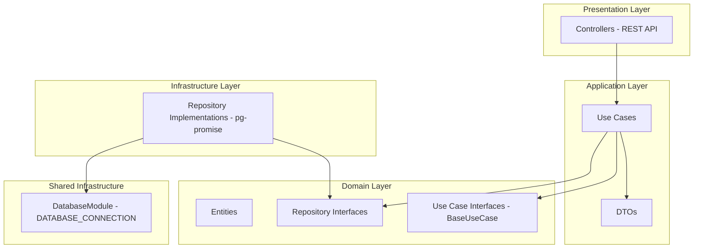
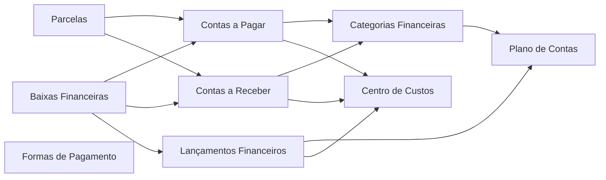

# Documento de Design - Módulo de Controle Financeiro

## Overview

Este documento descreve o design técnico para a implementação completa do módulo de controle financeiro do ERP modular. O módulo será composto por 8 submódulos independentes, cada um seguindo a arquitetura limpa (Clean Architecture) com as camadas: domain, application, infra e presentation.

O módulo financeiro atual possui apenas código esqueleto. Este design define a implementação completa de cada submódulo, seguindo os mesmos padrões arquiteturais já estabelecidos nos módulos `client` e `employee`.

### Submódulos

1. **Plano de Contas** (`chart-of-accounts`) - Estrutura hierárquica contábil
2. **Centro de Custos** (`cost-centers`) - Alocação de despesas/receitas por departamento
3. **Categorias Financeiras** (`financial-categories`) - Classificação de transações
4. **Contas a Pagar** (`accounts-payable`) - Obrigações financeiras
5. **Contas a Receber** (`accounts-receivable`) - Créditos e receitas previstas
6. **Parcelas** (`installments`) - Parcelamento de contas
7. **Baixas Financeiras** (`financial-settlements`) - Pagamentos/recebimentos efetivos
8. **Lançamentos Financeiros** (`financial-entries`) - Rastreabilidade de movimentações
9. **Formas de Pagamento** (`payment-methods`) - Categorização de formas de pagamento

## Architecture

### Diagrama de Camadas



### Diagrama de Dependência entre Submódulos



### Padrão de Estrutura de Pastas (por submódulo)

```
src/modules/finance/{submodulo}/
├── src/
│   ├── {submodulo}.module.ts
│   ├── domain/
│   │   ├── entity/
│   │   │   └── {entity}.entity.ts
│   │   ├── repository/
│   │   │   └── {entity}.interface.repository.ts
│   │   └── use-case/
│   │       └── base.use-case.ts
│   ├── application/
│   │   ├── dto/
│   │   │   ├── create-{entity}.dto.ts
│   │   │   ├── update-{entity}.dto.ts
│   │   │   └── pagination-query.dto.ts
│   │   └── use-cases/
│   │       ├── create-{entity}.use-case.ts
│   │       ├── get-by-id-{entity}.use-case.ts
│   │       ├── find-all-{entity}.use-case.ts
│   │       └── update-{entity}.use-case.ts
│   ├── infra/
│   │   └── repository/
│   │       └── {entity}.repository.ts
│   └── presentation/
│       └── controllers/
│           └── {entity}.controller.ts
└── tests/
```

### Decisões Arquiteturais

| Decisão | Escolha | Justificativa |
|---------|---------|---------------|
| ORM/Query Builder | pg-promise (raw SQL) | Padrão já estabelecido no projeto |
| Injeção de Dependência | Tokens string NestJS | Consistência com módulos existentes |
| Transações | `connection().tx()` do pg-promise | Atomicidade em operações multi-escrita |
| Paginação | LIMIT/OFFSET + COUNT separado | Padrão já utilizado no ClientRepository |
| Update parcial | COALESCE em SQL | Preserva valores existentes sem lógica extra |
| Validação | Classes DTO simples (sem decorators) | Padrão estabelecido nos módulos existentes |

## Components and Interfaces

### Interface Base - BaseUseCase

```typescript
export interface BaseUseCase<I, O> {
  execute(data: I): Promise<O>;
}
```

Todos os use-cases implementam esta interface, garantindo consistência na assinatura.

### Interfaces de Repositório

Cada submódulo define sua interface de repositório na camada de domínio:

```typescript
// Padrão genérico para repositórios financeiros
export interface IFinancialRepository<Entity, CreateDTO, UpdateDTO> {
  create(data: CreateDTO, transaction?: any): Promise<Entity>;
  findById(id: string): Promise<Entity | null>;
  findAll(page: number, limit: number): Promise<{ data: Entity[]; total: number }>;
  update(id: string, data: UpdateDTO, transaction?: any): Promise<Entity>;
}
```

#### IChartOfAccountsRepository

```typescript
export interface IChartOfAccountsRepository {
  create(data: CreateChartOfAccountsDTO, transaction?: any): Promise<ChartOfAccounts>;
  findById(id: string): Promise<ChartOfAccounts | null>;
  findAll(page: number, limit: number): Promise<{ data: ChartOfAccounts[]; total: number }>;
  update(id: string, data: UpdateChartOfAccountsDTO, transaction?: any): Promise<ChartOfAccounts>;
  findByCodigo(codigo: string): Promise<ChartOfAccounts | null>;
}
```

#### ICostCenterRepository

```typescript
export interface ICostCenterRepository {
  create(data: CreateCostCenterDTO, transaction?: any): Promise<CostCenter>;
  findById(id: string): Promise<CostCenter | null>;
  findAll(page: number, limit: number): Promise<{ data: CostCenter[]; total: number }>;
  update(id: string, data: UpdateCostCenterDTO, transaction?: any): Promise<CostCenter>;
  findByCodigo(codigo: string): Promise<CostCenter | null>;
}
```

#### IFinancialCategoryRepository

```typescript
export interface IFinancialCategoryRepository {
  create(data: CreateFinancialCategoryDTO, transaction?: any): Promise<FinancialCategory>;
  findById(id: string): Promise<FinancialCategory | null>;
  findAll(page: number, limit: number): Promise<{ data: FinancialCategory[]; total: number }>;
  update(id: string, data: UpdateFinancialCategoryDTO, transaction?: any): Promise<FinancialCategory>;
}
```

#### IAccountPayableRepository

```typescript
export interface IAccountPayableRepository {
  create(data: CreateAccountPayableDTO, transaction?: any): Promise<AccountPayable>;
  findById(id: string): Promise<AccountPayable | null>;
  findAll(page: number, limit: number): Promise<{ data: AccountPayable[]; total: number }>;
  update(id: string, data: UpdateAccountPayableDTO, transaction?: any): Promise<AccountPayable>;
  updateValorPago(id: string, valorPago: number, status: string, transaction?: any): Promise<AccountPayable>;
}
```

#### IAccountReceivableRepository

```typescript
export interface IAccountReceivableRepository {
  create(data: CreateAccountReceivableDTO, transaction?: any): Promise<AccountReceivable>;
  findById(id: string): Promise<AccountReceivable | null>;
  findAll(page: number, limit: number): Promise<{ data: AccountReceivable[]; total: number }>;
  update(id: string, data: UpdateAccountReceivableDTO, transaction?: any): Promise<AccountReceivable>;
  updateValorRecebido(id: string, valorRecebido: number, status: string, transaction?: any): Promise<AccountReceivable>;
}
```

#### IInstallmentRepository

```typescript
export interface IInstallmentRepository {
  create(data: CreateInstallmentDTO, transaction?: any): Promise<Installment>;
  findById(id: string): Promise<Installment | null>;
  findByOrigemId(origemId: string): Promise<Installment[]>;
}
```

#### IFinancialSettlementRepository

```typescript
export interface IFinancialSettlementRepository {
  create(data: CreateFinancialSettlementDTO, transaction?: any): Promise<FinancialSettlement>;
  findById(id: string): Promise<FinancialSettlement | null>;
  findByContaId(contaId: string): Promise<FinancialSettlement[]>;
}
```

#### IFinancialEntryRepository

```typescript
export interface IFinancialEntryRepository {
  create(data: CreateFinancialEntryDTO, transaction?: any): Promise<FinancialEntry>;
  findById(id: string): Promise<FinancialEntry | null>;
  findAll(page: number, limit: number): Promise<{ data: FinancialEntry[]; total: number }>;
}
```

#### IPaymentMethodRepository

```typescript
export interface IPaymentMethodRepository {
  create(data: CreatePaymentMethodDTO, transaction?: any): Promise<PaymentMethod>;
  findById(id: string): Promise<PaymentMethod | null>;
  findAll(page: number, limit: number): Promise<{ data: PaymentMethod[]; total: number }>;
  update(id: string, data: UpdatePaymentMethodDTO, transaction?: any): Promise<PaymentMethod>;
}
```

### Padrão de Registro de Módulo NestJS

```typescript
@Module({
  imports: [],
  controllers: [ChartOfAccountsController],
  providers: [
    { provide: 'IChartOfAccountsRepository', useClass: ChartOfAccountsRepository },
    CreateChartOfAccountsUseCase,
    GetByIdChartOfAccountsUseCase,
    FindAllChartOfAccountsUseCase,
    UpdateChartOfAccountsUseCase,
  ],
  exports: [
    CreateChartOfAccountsUseCase,
    GetByIdChartOfAccountsUseCase,
    FindAllChartOfAccountsUseCase,
    UpdateChartOfAccountsUseCase,
  ],
})
export class ChartOfAccountsModule {}
```

### Padrão de Use Case com Injeção de Dependência

```typescript
export class CreateChartOfAccountsUseCase implements BaseUseCase<CreateChartOfAccountsDTO, ChartOfAccounts> {
  constructor(
    @Inject('IChartOfAccountsRepository')
    private readonly repository: IChartOfAccountsRepository,
  ) {}

  async execute(data: CreateChartOfAccountsDTO): Promise<ChartOfAccounts> {
    // Validações de negócio
    // Chamada ao repositório
    // Retorno da entidade criada
  }
}
```

### Padrão de Repositório com pg-promise

```typescript
export class ChartOfAccountsRepository implements IChartOfAccountsRepository {
  constructor(
    @Inject('DATABASE_CONNECTION')
    private readonly connection: any,
  ) {}

  async create(data: CreateChartOfAccountsDTO, transaction?: any): Promise<ChartOfAccounts> {
    const db = transaction || this.connection();
    return db.one(
      `INSERT INTO plano_contas (id, codigo, nome, tipo, natureza, conta_pai_id, aceita_lancamento)
       VALUES (gen_random_uuid(), $1, $2, $3, $4, $5, $6) RETURNING *`,
      [data.codigo, data.nome, data.tipo, data.natureza, data.contaPaiId, data.aceitaLancamento]
    );
  }
}
```

## Data Models

### Entidades

#### ChartOfAccounts (Plano de Contas)

```typescript
export class ChartOfAccounts {
  id: string;
  codigo: string;
  nome: string;
  tipo: 'SINTETICA' | 'ANALITICA';
  natureza: 'RECEITA' | 'DESPESA' | 'ATIVO' | 'PASSIVO' | 'PATRIMONIO';
  contaPaiId?: string;
  aceitaLancamento: boolean;
  ativo: boolean;
  createdAt: Date;
  updatedAt?: Date;
}
```

#### CostCenter (Centro de Custos)

```typescript
export class CostCenter {
  id: string;
  codigo: string;
  nome: string;
  descricao?: string;
  centroPaiId?: string;
  ativo: boolean;
  createdAt: Date;
  updatedAt?: Date;
}
```

#### FinancialCategory (Categoria Financeira)

```typescript
export class FinancialCategory {
  id: string;
  nome: string;
  descricao?: string;
  tipo: string;
  planoContaId?: string;
  ativo: boolean;
  createdAt: Date;
  updatedAt?: Date;
}
```

#### AccountPayable (Conta a Pagar)

```typescript
export class AccountPayable {
  id: string;
  pessoaId: string;
  numeroDocumento: string;
  descricao: string;
  categoriaFinanceiraId: string;
  centroCustoId?: string;
  contaBancariaId?: string;
  dataEmissao: Date;
  dataVencimento: Date;
  valor: number;
  valorPago: number;
  status: string;
  formaPagamento?: string;
  createdAt: Date;
  updatedAt?: Date;
}
```

#### AccountReceivable (Conta a Receber)

```typescript
export class AccountReceivable {
  id: string;
  pessoaId: string;
  numeroDocumento: string;
  descricao: string;
  categoriaFinanceiraId: string;
  centroCustoId?: string;
  contaBancariaId?: string;
  dataEmissao: Date;
  dataVencimento: Date;
  valor: number;
  valorRecebido: number;
  status: string;
  formaPagamento?: string;
  createdAt: Date;
  updatedAt?: Date;
}
```

#### Installment (Parcela)

```typescript
export class Installment {
  id: string;
  origem: 'PAGAR' | 'RECEBER';
  origemId: string;
  numeroParcela: number;
  totalParcelas: number;
  dataVencimento: Date;
  valor: number;
  status: string;
  createdAt: Date;
  updatedAt?: Date;
}
```

#### FinancialSettlement (Baixa Financeira)

```typescript
export class FinancialSettlement {
  id: string;
  tipoConta: 'RECEBER' | 'PAGAR';
  contaId: string;
  valor: number;
  dataPagamento: Date;
  formaPagamento: string;
  contaBancariaId?: string;
  caixaId?: string;
  lancamentoFinanceiroId: string;
  observacao?: string;
  createdAt: Date;
  updatedAt?: Date;
}
```

#### FinancialEntry (Lançamento Financeiro)

```typescript
export class FinancialEntry {
  id: string;
  tipo: 'RECEITA' | 'DESPESA';
  origem: string;
  origemId: string;
  planoContaId: string;
  centroCustoId?: string;
  contaBancariaId?: string;
  caixaId?: string;
  dataLancamento: Date;
  descricao: string;
  valor: number;
  saldoAnterior?: number;
  saldoPosterior?: number;
}
```

#### PaymentMethod (Forma de Pagamento)

```typescript
export class PaymentMethod {
  id: string;
  nome: string;
  descricao?: string;
  ativo: boolean;
}
```

### DTOs

#### Padrão CreateDTO (exemplo: Plano de Contas)

```typescript
export class CreateChartOfAccountsDTO {
  codigo: string;
  nome: string;
  tipo: 'SINTETICA' | 'ANALITICA';
  natureza: 'RECEITA' | 'DESPESA' | 'ATIVO' | 'PASSIVO' | 'PATRIMONIO';
  contaPaiId?: string;
  aceitaLancamento: boolean;
}
```

#### Padrão UpdateDTO (exemplo: Plano de Contas)

```typescript
export class UpdateChartOfAccountsDTO {
  codigo?: string;
  nome?: string;
  tipo?: 'SINTETICA' | 'ANALITICA';
  natureza?: 'RECEITA' | 'DESPESA' | 'ATIVO' | 'PASSIVO' | 'PATRIMONIO';
  contaPaiId?: string;
  aceitaLancamento?: boolean;
  ativo?: boolean;
}
```

#### PaginationQueryDTO (compartilhado)

```typescript
export class PaginationQueryDTO {
  page?: number = 1;
  limit?: number = 10;
}
```

### Mapeamento Entidade → Tabela

| Entidade | Tabela | Observações |
|----------|--------|-------------|
| ChartOfAccounts | plano_contas | Auto-referência via conta_pai_id |
| CostCenter | centro_custos | Auto-referência via centro_pai_id |
| FinancialCategory | categorias_financeiras | FK para plano_contas |
| AccountPayable | contas_pagar | FK para pessoa, categorias_financeiras, centro_custos |
| AccountReceivable | contas_receber | FK para pessoa, categorias_financeiras, centro_custos |
| Installment | parcelas | Referência polimórfica via origem + origem_id |
| FinancialSettlement | baixas_financeiras | FK para lancamentos_financeiros |
| FinancialEntry | lancamentos_financeiros | FK para plano_contas, centro_custos |
| PaymentMethod | (nova tabela: formas_pagamento) | Tabela simples de cadastro |


## Correctness Properties

*Uma propriedade é uma característica ou comportamento que deve ser verdadeiro em todas as execuções válidas de um sistema — essencialmente, uma declaração formal sobre o que o sistema deve fazer. Propriedades servem como ponte entre especificações legíveis por humanos e garantias de corretude verificáveis por máquina.*

### Property 1: Round-trip de criação e consulta

*Para qualquer* entidade financeira válida (ChartOfAccounts, CostCenter, FinancialCategory, AccountPayable, AccountReceivable, Installment, FinancialSettlement, FinancialEntry, PaymentMethod), criar a entidade e em seguida consultá-la por id deve retornar dados equivalentes aos dados de entrada (exceto campos gerados pelo sistema como id, createdAt, updatedAt).

**Validates: Requirements 2.1, 2.2, 3.1, 3.2, 4.1, 4.4, 5.1, 5.2, 6.1, 6.2, 7.1, 7.2, 8.7, 9.1, 9.3, 10.1, 10.2**

### Property 2: Invariantes de paginação

*Para qualquer* conjunto de registros no banco de dados e quaisquer parâmetros válidos de page (≥1) e limit (1-100), a resposta paginada deve satisfazer: (a) o número de itens retornados é ≤ limit, (b) totalPages = ceil(total / limit), (c) os itens correspondem ao offset correto (page - 1) * limit, e (d) quando page ou limit são inválidos (page < 1, limit < 1 ou limit > 100), os valores padrão (page=1, limit=10) são utilizados.

**Validates: Requirements 2.3, 3.3, 4.5, 5.3, 6.3, 9.5, 9.6, 10.3, 11.5, 12.5**

### Property 3: Atualização parcial preserva campos não informados

*Para qualquer* entidade financeira existente e qualquer subconjunto de campos enviados em uma requisição PUT, após a atualização: (a) os campos enviados devem refletir os novos valores, e (b) os campos não enviados devem manter seus valores originais inalterados (comportamento COALESCE).

**Validates: Requirements 2.4, 3.4, 4.6, 5.4, 6.4, 10.4, 12.6**

### Property 4: Rejeição de entrada inválida

*Para qualquer* requisição de criação ou atualização que contenha campos obrigatórios ausentes, valores de enum inválidos, strings excedendo limites de caracteres, ou valores numéricos fora dos intervalos permitidos, o sistema deve rejeitar a requisição com status HTTP 400 e o estado do banco de dados deve permanecer inalterado.

**Validates: Requirements 2.7, 3.7, 4.2, 5.9, 6.9, 9.2, 10.6**

### Property 5: Validação de datas — vencimento ≥ emissão

*Para qualquer* par de datas onde data_vencimento é anterior a data_emissao, a criação ou atualização de contas a pagar ou contas a receber deve ser rejeitada, e nenhum registro deve ser persistido.

**Validates: Requirements 5.8, 6.8**

### Property 6: Inicialização de valores padrão em novas entidades

*Para qualquer* conta a pagar, conta a receber ou parcela recém-criada com dados válidos, o campo status deve ser inicializado como 'PENDENTE', e os campos valor_pago (contas a pagar) ou valor_recebido (contas a receber) devem ser inicializados como 0.

**Validates: Requirements 5.7, 6.7, 7.4**

### Property 7: Baixa financeira incrementa valor pago/recebido e transiciona status

*Para qualquer* conta (a pagar ou a receber) com saldo restante positivo e qualquer valor de baixa válido (0 < valor ≤ saldo restante), após registrar a baixa: (a) o valor_pago/valor_recebido da conta deve ser incrementado exatamente pelo valor da baixa, e (b) se o valor acumulado igualar ou superar o valor total da conta, o status deve transicionar para 'PAGO' (contas a pagar) ou 'RECEBIDO' (contas a receber).

**Validates: Requirements 8.2, 8.3**

### Property 8: Baixa não pode exceder saldo restante

*Para qualquer* conta (a pagar ou a receber) e qualquer valor de baixa que, somado ao valor já pago/recebido, ultrapasse o valor total da conta, o sistema deve rejeitar a operação com erro de validação e nenhuma alteração deve ser persistida.

**Validates: Requirements 8.6**

### Property 9: Baixa financeira cria lançamento associado atomicamente

*Para qualquer* baixa financeira registrada com sucesso, deve existir exatamente um lançamento financeiro associado com: tipo = 'DESPESA' (se tipo_conta = PAGAR) ou tipo = 'RECEITA' (se tipo_conta = RECEBER), origem = 'BAIXA', origem_id = id da baixa, data_lancamento = data_pagamento da baixa, e valor = valor da baixa.

**Validates: Requirements 8.4**

### Property 10: Validação numero_parcela ≤ total_parcelas

*Para qualquer* requisição de criação de parcela onde numero_parcela > total_parcelas, o sistema deve rejeitar com status 400 e nenhum registro deve ser criado.

**Validates: Requirements 7.7**

### Property 11: Cálculo de saldo em lançamentos financeiros

*Para qualquer* lançamento financeiro que possua conta_bancaria_id ou caixa_id informado, o sistema deve registrar saldo_anterior (saldo atual antes do lançamento) e calcular saldo_posterior como: saldo_anterior + valor (se tipo = RECEITA) ou saldo_anterior - valor (se tipo = DESPESA).

**Validates: Requirements 9.7**

### Property 12: Atomicidade de transações em operações multi-escrita

*Para qualquer* operação que envolva múltiplas escritas no banco de dados (ex: baixa financeira que atualiza conta + cria lançamento), se qualquer operação individual falhar, todas as operações da transação devem ser revertidas e o estado do banco deve permanecer inalterado.

**Validates: Requirements 1.5, 8.4**

### Property 13: Parcelas ordenadas por numero_parcela

*Para qualquer* conta (a pagar ou a receber) com múltiplas parcelas, ao consultar parcelas por origemId, a lista retornada deve estar ordenada por numero_parcela em ordem crescente.

**Validates: Requirements 7.3**

### Property 14: Filtro de baixas por contaId retorna apenas registros correspondentes

*Para qualquer* conjunto de baixas financeiras distribuídas entre múltiplas contas, ao filtrar por contaId, todos os registros retornados devem ter contaId igual ao parâmetro informado, e nenhum registro de outra conta deve ser incluído.

**Validates: Requirements 8.8**

## Error Handling

### Estratégia de Erros por Camada

| Camada | Responsabilidade | Padrão |
|--------|-----------------|--------|
| Presentation (Controller) | Captura exceções e retorna HTTP status adequado | try/catch com mapeamento de exceções |
| Application (Use Case) | Validação de regras de negócio, lança exceções tipadas | Throw HttpException do NestJS |
| Infrastructure (Repository) | Propaga erros do pg-promise sem interceptar | QueryResultError propagado |

### Códigos de Erro HTTP

| Código | Cenário |
|--------|---------|
| 400 | Campos obrigatórios ausentes, valores inválidos, limites excedidos |
| 404 | Recurso não encontrado (GET por id, PUT em id inexistente) |
| 409 | Violação de unicidade (codigo duplicado em plano_contas, centro_custos) |
| 422 | Referência a entidade inexistente (plano_conta_id inválido em categorias) |
| 500 | Erros inesperados do banco de dados |

### Formato de Resposta de Erro

```typescript
{
  statusCode: number;
  message: string;
  error: string;
}
```

### Tratamento de Transações

Para operações que envolvem múltiplas escritas (ex: baixa financeira):

```typescript
async execute(data: CreateFinancialSettlementDTO) {
  return this.connection().tx(async (transaction) => {
    // 1. Buscar conta e validar saldo
    // 2. Criar lançamento financeiro
    // 3. Criar baixa financeira
    // 4. Atualizar valor_pago/valor_recebido da conta
    // Se qualquer etapa falhar, toda a transação é revertida
  });
}
```

## Testing Strategy

### Abordagem Dual

O módulo financeiro será testado com duas abordagens complementares:

1. **Testes unitários (example-based)**: Verificam cenários específicos, edge cases e condições de erro
2. **Testes de propriedade (property-based)**: Verificam propriedades universais com inputs gerados aleatoriamente

### Biblioteca de Property-Based Testing

- **Biblioteca**: [fast-check](https://github.com/dubzzz/fast-check) (TypeScript/JavaScript)
- **Framework de testes**: Jest (já configurado no projeto)
- **Mínimo de iterações**: 100 por propriedade

### Configuração dos Testes de Propriedade

Cada teste de propriedade deve:
- Executar no mínimo 100 iterações (`numRuns: 100`)
- Referenciar a propriedade do documento de design via tag
- Formato da tag: `Feature: financial-control-module, Property {number}: {property_text}`
- Utilizar mocks para o repositório (evitar dependência de banco real nos testes unitários)

### Estrutura de Testes

```
src/modules/finance/{submodulo}/tests/
├── unit/
│   ├── create-{entity}.use-case.spec.ts
│   ├── get-by-id-{entity}.use-case.spec.ts
│   ├── find-all-{entity}.use-case.spec.ts
│   └── update-{entity}.use-case.spec.ts
└── property/
    └── {entity}.property.spec.ts
```

### Cobertura por Tipo de Teste

| Tipo | Foco | Exemplos |
|------|------|----------|
| Property tests | Propriedades 1-14 do design | Round-trip, paginação, COALESCE, validações |
| Unit tests | Edge cases, erros 404/409/422 | ID inexistente, codigo duplicado, referência inválida |
| Integration tests | Fluxo completo com banco | Baixa financeira end-to-end, transações |

### Generators (fast-check)

Para os testes de propriedade, serão criados generators customizados:

```typescript
// Exemplo de generator para ChartOfAccounts
const chartOfAccountsArb = fc.record({
  codigo: fc.string({ minLength: 1, maxLength: 20 }),
  nome: fc.string({ minLength: 1, maxLength: 150 }),
  tipo: fc.constantFrom('SINTETICA', 'ANALITICA'),
  natureza: fc.constantFrom('RECEITA', 'DESPESA', 'ATIVO', 'PASSIVO', 'PATRIMONIO'),
  contaPaiId: fc.option(fc.uuid()),
  aceitaLancamento: fc.boolean(),
});

// Generator para valores monetários
const monetaryValueArb = fc.double({ min: 0.01, max: 999999999.99 })
  .map(v => Math.round(v * 100) / 100);

// Generator para datas válidas (vencimento >= emissão)
const validDatePairArb = fc.tuple(
  fc.date({ min: new Date('2020-01-01'), max: new Date('2030-12-31') }),
  fc.nat({ max: 365 })
).map(([emissao, diasAdicional]) => ({
  dataEmissao: emissao,
  dataVencimento: new Date(emissao.getTime() + diasAdicional * 86400000),
}));
```

### Testes Unitários (Example-Based)

Foco em:
- Cenários de erro 404 (recurso não encontrado)
- Cenários de erro 409 (codigo duplicado)
- Cenários de erro 422 (referência inválida)
- Valores padrão de paginação quando não informados
- Propagação de QueryResultError do pg-promise
