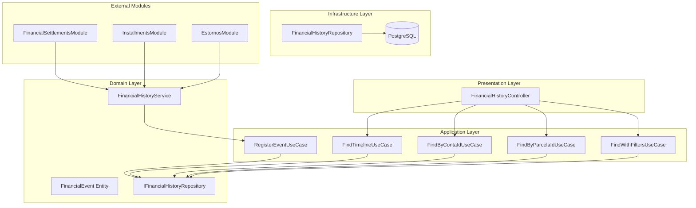
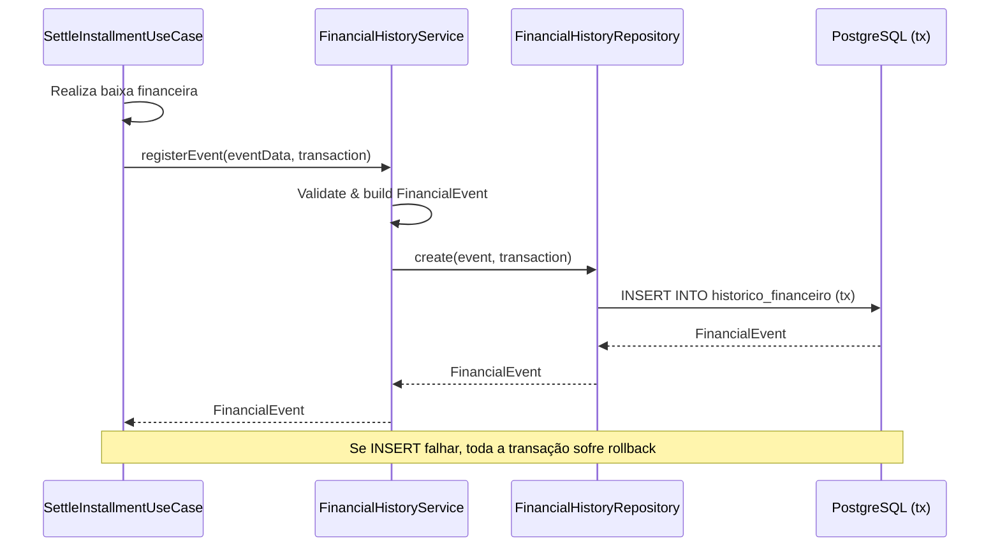
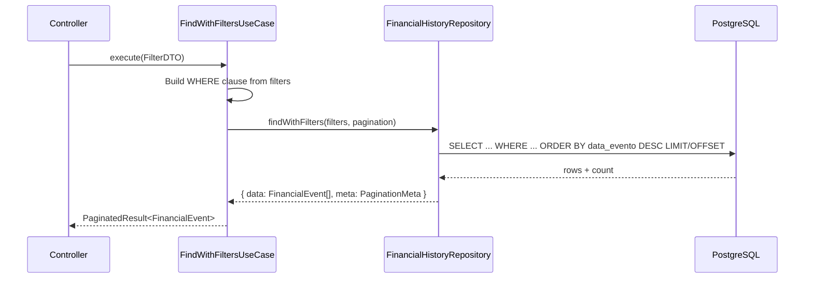

# Design Document: Financial History

## Overview

Este design descreve a implementação do módulo de **Histórico Financeiro Unificado** — uma timeline/audit trail que registra automaticamente todos os eventos financeiros do sistema de forma imutável. O módulo funciona como um log append-only que captura pagamentos, recebimentos, estornos, criação/cancelamento de parcelas, baixas parciais e alterações de status.

### Decisões de Design

- **Append-only**: A tabela de histórico não permite UPDATE ou DELETE. Eventos são imutáveis após inserção, garantindo integridade para auditoria.
- **Integração via serviço**: Os módulos existentes (financial-settlements, installments, estornos) invocam o `FinancialHistoryService` dentro da mesma transação pg-promise, garantindo consistência atômica.
- **Metadados flexíveis**: Um campo JSONB `metadados` armazena informações específicas de cada tipo de evento (juros, multa, desconto, motivo do estorno, forma de pagamento), evitando colunas opcionais excessivas.
- **Reutilização da tabela existente**: O banco já possui a tabela `historico_contas`. O design a evolui para suportar os novos campos (parcelaId, pessoaId, referenciaId, metadados) mantendo compatibilidade.
- **Sem eventos/filas**: O registro ocorre de forma síncrona dentro da transação principal. Se o registro falhar, a transação inteira sofre rollback. Isso garante consistência forte em detrimento de desacoplamento.

## Architecture



### Fluxo de Registro de Evento (dentro de transação existente)



### Fluxo de Consulta com Filtros



## Components and Interfaces

### Entidade: FinancialEvent

```typescript
export type TipoEvento =
  | 'PAGAMENTO'
  | 'RECEBIMENTO'
  | 'ESTORNO'
  | 'CRIACAO_PARCELA'
  | 'CANCELAMENTO_PARCELA'
  | 'BAIXA_PARCIAL'
  | 'ALTERACAO_STATUS';

export type TipoConta = 'PAGAR' | 'RECEBER';

export interface EventoMetadados {
  juros?: number;
  multa?: number;
  desconto?: number;
  motivoEstorno?: string;
  formaPagamento?: string;
  statusAnterior?: string;
  statusNovo?: string;
  quantidadeParcelas?: number;
  numeroParcela?: number;
  saldoRestante?: number;
  valorTotal?: number;
}

export class FinancialEvent {
  id: string;
  tipoEvento: TipoEvento;
  tipoConta: TipoConta;
  contaId: string;
  parcelaId?: string;
  pessoaId: string;
  valor: number;
  descricao: string;
  referenciaId: string;
  metadados?: EventoMetadados;
  usuarioId?: string;
  dataEvento: Date;
  createdAt: Date;
}
```

### Interface: IFinancialHistoryRepository

```typescript
export interface PaginationParams {
  page: number;
  pageSize: number;
}

export interface PaginationMeta {
  page: number;
  pageSize: number;
  total: number;
  totalPages: number;
}

export interface PaginatedResult<T> {
  data: T[];
  meta: PaginationMeta;
}

export interface FinancialHistoryFilters {
  contaId?: string;
  parcelaId?: string;
  pessoaId?: string;
  tipoEvento?: TipoEvento;
  tipoConta?: TipoConta;
  dataInicio?: Date;
  dataFim?: Date;
}

export interface IFinancialHistoryRepository {
  create(data: Omit<FinancialEvent, 'id' | 'createdAt'>, transaction?: any): Promise<FinancialEvent>;
  findByContaId(contaId: string, pagination: PaginationParams): Promise<PaginatedResult<FinancialEvent>>;
  findByParcelaId(parcelaId: string, pagination: PaginationParams): Promise<PaginatedResult<FinancialEvent>>;
  findWithFilters(filters: FinancialHistoryFilters, pagination: PaginationParams): Promise<PaginatedResult<FinancialEvent>>;
  findTimeline(pagination: PaginationParams): Promise<PaginatedResult<FinancialEvent & { pessoaNome: string }>>;
}
```

### Serviço: FinancialHistoryService

```typescript
export interface RegisterEventInput {
  tipoEvento: TipoEvento;
  tipoConta: TipoConta;
  contaId: string;
  parcelaId?: string;
  pessoaId: string;
  valor: number;
  descricao: string;
  referenciaId: string;
  metadados?: EventoMetadados;
  usuarioId?: string;
  dataEvento: Date;
}

export class FinancialHistoryService {
  constructor(
    @Inject('IFinancialHistoryRepository')
    private readonly repository: IFinancialHistoryRepository,
  ) {}

  async registerEvent(input: RegisterEventInput, transaction?: any): Promise<FinancialEvent>;
}
```

### DTOs

```typescript
// Consulta por conta
export class FindByContaIdDTO {
  contaId: string;
  page?: number;    // default: 1
  pageSize?: number; // default: 20
}

// Consulta por parcela
export class FindByParcelaIdDTO {
  parcelaId: string;
  page?: number;    // default: 1
  pageSize?: number; // default: 20
}

// Consulta com filtros
export class FindWithFiltersDTO {
  tipoEvento?: TipoEvento;
  tipoConta?: TipoConta;
  pessoaId?: string;
  dataInicio?: Date;
  dataFim?: Date;
  page?: number;    // default: 1
  pageSize?: number; // default: 20
}

// Timeline geral
export class FindTimelineDTO {
  page?: number;    // default: 1
  pageSize?: number; // default: 20, max: 100
}
```

### Use Cases

| Use Case | Input | Output | Descrição |
|----------|-------|--------|-----------|
| `RegisterEventUseCase` | `RegisterEventInput` + `transaction` | `FinancialEvent` | Registra um evento no histórico (uso interno) |
| `FindByContaIdUseCase` | `FindByContaIdDTO` | `PaginatedResult<FinancialEvent>` | Lista eventos de uma conta |
| `FindByParcelaIdUseCase` | `FindByParcelaIdDTO` | `PaginatedResult<FinancialEvent>` | Lista eventos de uma parcela |
| `FindWithFiltersUseCase` | `FindWithFiltersDTO` | `PaginatedResult<FinancialEvent>` | Busca com filtros combinados |
| `FindTimelineUseCase` | `FindTimelineDTO` | `PaginatedResult<FinancialEvent & { pessoaNome }>` | Timeline geral com nome da pessoa |

### Endpoints REST

| Método | Rota | Use Case | Descrição |
|--------|------|----------|-----------|
| GET | `/financial-history/conta/:contaId` | FindByContaIdUseCase | Histórico por conta |
| GET | `/financial-history/parcela/:parcelaId` | FindByParcelaIdUseCase | Histórico por parcela |
| GET | `/financial-history` | FindWithFiltersUseCase | Busca com filtros (query params) |
| GET | `/financial-history/timeline` | FindTimelineUseCase | Timeline geral |

### Módulo NestJS

```typescript
@Module({
  imports: [DatabaseModule],
  controllers: [FinancialHistoryController],
  providers: [
    {
      provide: 'IFinancialHistoryRepository',
      useClass: FinancialHistoryRepository,
    },
    FinancialHistoryService,
    RegisterEventUseCase,
    FindByContaIdUseCase,
    FindByParcelaIdUseCase,
    FindWithFiltersUseCase,
    FindTimelineUseCase,
  ],
  exports: [FinancialHistoryService],
})
export class FinancialHistoryModule {}
```

Os módulos que precisam registrar eventos importam `FinancialHistoryModule` e injetam `FinancialHistoryService`.

## Data Models

### Tabela: `historico_financeiro` (Nova — substitui `historico_contas`)

```sql
CREATE TABLE historico_financeiro (
  id UUID PRIMARY KEY DEFAULT gen_random_uuid(),
  tipo_evento VARCHAR(30) NOT NULL 
    CHECK (tipo_evento IN ('PAGAMENTO', 'RECEBIMENTO', 'ESTORNO', 'CRIACAO_PARCELA', 'CANCELAMENTO_PARCELA', 'BAIXA_PARCIAL', 'ALTERACAO_STATUS')),
  tipo_conta VARCHAR(10) NOT NULL 
    CHECK (tipo_conta IN ('PAGAR', 'RECEBER')),
  conta_id UUID NOT NULL,
  parcela_id UUID NULL,
  pessoa_id UUID NOT NULL,
  valor NUMERIC(15, 2) NOT NULL,
  descricao VARCHAR(255) NOT NULL,
  referencia_id UUID NOT NULL,
  metadados JSONB NULL,
  usuario_id UUID NULL,
  data_evento TIMESTAMP NOT NULL,
  created_at TIMESTAMP NOT NULL DEFAULT NOW()
);

-- Índices para consultas frequentes
CREATE INDEX idx_hist_fin_conta_id ON historico_financeiro(conta_id);
CREATE INDEX idx_hist_fin_parcela_id ON historico_financeiro(parcela_id) WHERE parcela_id IS NOT NULL;
CREATE INDEX idx_hist_fin_pessoa_id ON historico_financeiro(pessoa_id);
CREATE INDEX idx_hist_fin_tipo_evento ON historico_financeiro(tipo_evento);
CREATE INDEX idx_hist_fin_data_evento ON historico_financeiro(data_evento DESC);
CREATE INDEX idx_hist_fin_tipo_conta ON historico_financeiro(tipo_conta);

-- Índice composto para filtros combinados
CREATE INDEX idx_hist_fin_filters ON historico_financeiro(tipo_conta, tipo_evento, data_evento DESC);
```

### Migration: Migrar dados de `historico_contas` para `historico_financeiro`

```sql
-- Migrar dados existentes (se houver)
INSERT INTO historico_financeiro (id, tipo_evento, tipo_conta, conta_id, pessoa_id, valor, descricao, referencia_id, data_evento, created_at)
SELECT 
  id,
  tipo_evento,
  tipo_conta::VARCHAR,
  conta_id,
  '00000000-0000-0000-0000-000000000000', -- placeholder para pessoaId (migração manual necessária)
  COALESCE(valor_novo, 0),
  descricao,
  conta_id, -- referenciaId = contaId para dados legados
  createdAt,
  createdAt
FROM historico_contas;

-- Após validação, a tabela antiga pode ser removida
-- DROP TABLE historico_contas;
```

### Regra de Imutabilidade (via trigger)

```sql
-- Trigger para impedir UPDATE e DELETE
CREATE OR REPLACE FUNCTION prevent_historico_modification()
RETURNS TRIGGER AS $$
BEGIN
  RAISE EXCEPTION 'O histórico financeiro é imutável. Operações de % não são permitidas.', TG_OP;
  RETURN NULL;
END;
$$ LANGUAGE plpgsql;

CREATE TRIGGER trg_historico_imutavel_update
  BEFORE UPDATE ON historico_financeiro
  FOR EACH ROW EXECUTE FUNCTION prevent_historico_modification();

CREATE TRIGGER trg_historico_imutavel_delete
  BEFORE DELETE ON historico_financeiro
  FOR EACH ROW EXECUTE FUNCTION prevent_historico_modification();
```


## Correctness Properties

*A property is a characteristic or behavior that should hold true across all valid executions of a system — essentially, a formal statement about what the system should do. Properties serve as the bridge between human-readable specifications and machine-verifiable correctness guarantees.*

### Property 1: Event type mapping correctness

*For any* financial operation (baixa, estorno, criação de parcela, cancelamento, baixa parcial, alteração de status), the registered event SHALL have the correct `tipoEvento` derived from the operation type, and the correct `tipoConta` derived from the account type (PAGAR→PAGAMENTO, RECEBER→RECEBIMENTO for settlements; ESTORNO for reversals; CRIACAO_PARCELA for installment generation; CANCELAMENTO_PARCELA for cancellations; BAIXA_PARCIAL for partial settlements; ALTERACAO_STATUS for status changes).

**Validates: Requirements 1.1, 1.2, 1.3, 1.4, 1.5, 1.6**

### Property 2: Event structural completeness

*For any* valid event registration input, the stored `FinancialEvent` SHALL contain all required fields (id, tipoEvento, tipoConta, contaId, pessoaId, valor, descricao, referenciaId, dataEvento, createdAt) with non-null values, and `parcelaId` when the operation involves a specific installment.

**Validates: Requirements 2.1, 2.2**

### Property 3: Metadados round-trip preservation

*For any* valid `EventoMetadados` object provided during event registration, storing and then retrieving the event SHALL return metadados with all original key-value pairs preserved exactly.

**Validates: Requirements 2.4**

### Property 4: Query results ordering invariant

*For any* query (by contaId, by parcelaId, or timeline), the returned events SHALL be ordered by `dataEvento` in strictly descending order — that is, for any two consecutive events in the result, the first event's `dataEvento` is greater than or equal to the second's.

**Validates: Requirements 3.1, 5.1, 6.1**

### Property 5: Pagination correctness

*For any* set of N events matching a query, requesting page P with pageSize S SHALL return exactly min(S, N - (P-1)*S) events (or 0 if P exceeds total pages), and the union of all pages SHALL equal the complete result set with no duplicates or omissions.

**Validates: Requirements 3.3, 6.2**

### Property 6: Filter correctness with AND semantics

*For any* combination of filters (tipoEvento, tipoConta, pessoaId, dataInicio, dataFim), every event in the result set SHALL satisfy ALL active filters simultaneously, and no event satisfying all filters SHALL be excluded from the result set.

**Validates: Requirements 4.1, 4.2, 4.3, 4.4, 4.5**

### Property 7: Immutability invariant

*For any* existing event in the history, any attempt to update or delete it SHALL be rejected with an error, and the event's data SHALL remain unchanged after the rejected operation.

**Validates: Requirements 7.1, 7.3**

### Property 8: Unique ID generation

*For any* set of N events created (sequentially or concurrently), all N events SHALL have distinct `id` values, and each `id` SHALL be a valid UUID.

**Validates: Requirements 7.4**

## Error Handling

### Erros de Validação (HTTP 400)

| Cenário | Mensagem |
|---------|----------|
| tipoEvento inválido | "Tipo de evento inválido. Valores aceitos: PAGAMENTO, RECEBIMENTO, ESTORNO, CRIACAO_PARCELA, CANCELAMENTO_PARCELA, BAIXA_PARCIAL, ALTERACAO_STATUS" |
| tipoConta inválido | "Tipo de conta inválido. Valores aceitos: PAGAR, RECEBER" |
| dataInicio > dataFim | "Data início não pode ser posterior à data fim" |
| pageSize > 100 | "O tamanho máximo de página é 100 registros" |
| page < 1 | "O número da página deve ser maior que zero" |

### Erros de Integridade (HTTP 409)

| Cenário | Mensagem |
|---------|----------|
| Tentativa de UPDATE em evento | "O histórico financeiro é imutável. Operações de atualização não são permitidas." |
| Tentativa de DELETE em evento | "O histórico financeiro é imutável. Operações de exclusão não são permitidas." |

### Erros de Recurso Não Encontrado (HTTP 404)

| Cenário | Mensagem |
|---------|----------|
| contaId sem eventos (não é erro) | Retorna lista vazia com paginação `{ data: [], meta: { total: 0, ... } }` |
| parcelaId sem eventos (não é erro) | Retorna lista vazia com paginação `{ data: [], meta: { total: 0, ... } }` |

### Tratamento de Transações

- O `FinancialHistoryService.registerEvent()` recebe o objeto `transaction` do pg-promise como parâmetro
- Se o INSERT falhar (constraint violation, connection error), a exceção propaga para o caller
- Como o registro ocorre dentro da transação do módulo chamador, qualquer falha causa rollback automático de toda a operação
- Nenhum evento "órfão" é criado — ou a operação financeira E o evento são persistidos juntos, ou nenhum é

## Testing Strategy

### Abordagem Dual: Unit Tests + Property-Based Tests

Este feature é adequado para property-based testing porque:
- Contém lógica pura de mapeamento (tipo de operação → tipo de evento)
- Possui invariantes universais (imutabilidade, ordenação, completude de campos)
- A lógica de filtros é combinatória (múltiplos filtros com AND)
- O espaço de inputs é grande (datas, tipos de evento, valores, metadados JSON)
- A paginação tem propriedades matemáticas verificáveis

### Property-Based Testing

**Biblioteca**: [fast-check](https://github.com/dubzzz/fast-check) (TypeScript)

**Configuração**:
- Mínimo de 100 iterações por propriedade
- Cada teste deve referenciar a propriedade do design document
- Tag format: `Feature: financial-history, Property {N}: {title}`

**Propriedades a testar**:
1. Event type mapping correctness (Property 1)
2. Event structural completeness (Property 2)
3. Metadados round-trip preservation (Property 3)
4. Query results ordering invariant (Property 4)
5. Pagination correctness (Property 5)
6. Filter correctness with AND semantics (Property 6)
7. Immutability invariant (Property 7)
8. Unique ID generation (Property 8)

### Unit Tests (Example-Based)

Focar em:
- Edge cases: conta/parcela sem eventos retorna lista vazia com meta de paginação
- Timeline com pageSize padrão de 20
- Timeline inclui `pessoaNome` via JOIN com tabela `pessoa`
- `usuarioId` opcional (null quando não disponível)
- `createdAt` é gerado automaticamente no momento da inserção
- Validação de inputs (tipoEvento inválido, dataInicio > dataFim)
- Metadados específicos por tipo de evento (juros/multa/desconto para PAGAMENTO, motivoEstorno para ESTORNO)

### Integration Tests

- Transação completa: settlement + registro de evento (commit)
- Transação com falha: simular falha no INSERT do evento e verificar rollback do settlement
- Integração com módulo de estornos: estorno + registro de evento
- Integração com módulo de parcelas: geração de parcelas + registro de evento
- Query com JOIN na tabela `pessoa` para timeline

### Estrutura de Testes

```
src/modules/finance/financial-history/src/
  __tests__/
    register-event.use-case.spec.ts
    find-by-conta-id.use-case.spec.ts
    find-by-parcela-id.use-case.spec.ts
    find-with-filters.use-case.spec.ts
    find-timeline.use-case.spec.ts
    event-type-mapping.property.spec.ts
    event-structure.property.spec.ts
    metadados-roundtrip.property.spec.ts
    query-ordering.property.spec.ts
    pagination.property.spec.ts
    filter-correctness.property.spec.ts
    immutability.property.spec.ts
```
