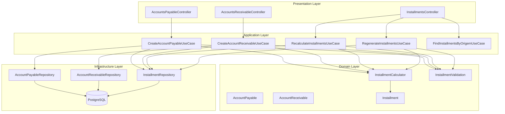
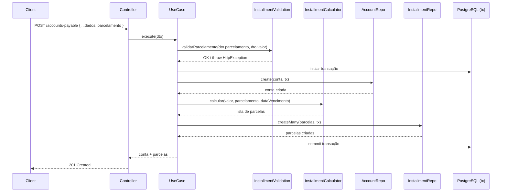

# Design Document: Parcelamento Integrado (Installment Payments)

## Overview

Esta feature refatora os módulos de Contas a Pagar e Contas a Receber para integrar nativamente o suporte a parcelamentos. O objetivo é unificar o fluxo de criação de contas com geração automática de parcelas, eliminando a necessidade de uma segunda chamada à API. Além disso, adiciona suporte a distribuição personalizada de valores por parcela, recalculação proporcional ao alterar o valor da conta e regeneração completa de parcelas.

### Decisões de Design

1. **Lógica de parcelamento como Domain Service**: A lógica de cálculo de parcelas (distribuição proporcional e personalizada) será encapsulada em um Domain Service (`InstallmentCalculator`) reutilizável pelos use cases de criação, recalculação e regeneração.
2. **Transação atômica via pg-promise `tx`**: Todas as operações que envolvem criação/alteração de conta + parcelas serão executadas dentro de uma única transação, seguindo o padrão já existente no projeto.
3. **Extensão dos DTOs existentes**: Os DTOs de criação de conta receberão um campo opcional `parcelamento` ao invés de criar novos endpoints.
4. **Parcela padrão quando sem parcelamento**: Quando o campo `parcelamento` não é informado, o sistema gera automaticamente uma parcela única com o valor total e a mesma data de vencimento da conta.
5. **Reutilização do módulo de installments**: Os novos use cases de recalculação e regeneração serão adicionados ao módulo `installments` existente, mantendo a coesão.

## Architecture



### Fluxo de Criação com Parcelamento



## Components and Interfaces

### 1. InstallmentCalculator (Domain Service)

Responsável pelo cálculo de valores e datas das parcelas.

```typescript
// src/modules/finance/installments/src/domain/services/installment-calculator.ts

export interface InstallmentCalculationInput {
  valorTotal: number;
  quantidadeParcelas: number;
  dataVencimentoBase: Date;
  intervaloMeses?: number;        // padrão: 1
  valores?: number[];             // distribuição personalizada
  datasVencimento?: Date[];       // datas personalizadas
}

export interface InstallmentCalculationOutput {
  numeroParcela: number;
  valor: number;
  dataVencimento: Date;
}

export class InstallmentCalculator {
  /**
   * Calcula parcelas com distribuição proporcional ou personalizada.
   * Garante que a soma dos valores === valorTotal (precisão de 2 casas decimais).
   */
  calculate(input: InstallmentCalculationInput): InstallmentCalculationOutput[];

  /**
   * Recalcula apenas parcelas pendentes redistribuindo o valor restante.
   */
  recalculate(
    valorRestante: number,
    parcelasPendentes: { numeroParcela: number; dataVencimento: Date }[],
  ): InstallmentCalculationOutput[];
}
```

### 2. InstallmentValidation (Domain Validation)

Responsável pelas validações de integridade do parcelamento.

```typescript
// src/modules/finance/installments/src/domain/validation/installment-validation.ts

export interface ParcelamentoInput {
  quantidadeParcelas: number;
  valores?: number[];
  datasVencimento?: Date[];
  intervaloMeses?: number;
}

export class InstallmentValidation {
  /**
   * Valida os dados de parcelamento antes da criação.
   * Lança HttpException em caso de erro.
   */
  validateCreation(parcelamento: ParcelamentoInput, valorTotal: number, dataEmissao: Date): void;

  /**
   * Valida integridade pós-operação: soma das parcelas ativas === valor total.
   */
  validateIntegrity(parcelas: { valor: number; status: string }[], valorTotal: number): void;
}
```

### 3. DTOs Estendidos

```typescript
// Extensão do CreateAccountPayableDTO
export class CreateAccountPayableDTO {
  // ... campos existentes ...
  parcelamento?: ParcelamentoDTO;
}

export class ParcelamentoDTO {
  quantidadeParcelas: number;       // 1-360
  intervaloMeses?: number;          // padrão: 1
  valores?: number[];               // distribuição personalizada
  datasVencimento?: Date[];         // datas personalizadas
}
```

### 4. Novos Use Cases

```typescript
// RecalculateInstallmentsUseCase
export class RecalculateInstallmentsDTO {
  contaId: string;
  tipoConta: 'PAGAR' | 'RECEBER';
  novoValorTotal: number;
}

// RegenerateInstallmentsUseCase
export class RegenerateInstallmentsDTO {
  contaId: string;
  tipoConta: 'PAGAR' | 'RECEBER';
  quantidadeParcelas: number;
  intervaloMeses?: number;
  valores?: number[];
  datasVencimento?: Date[];
}
```

### 5. Extensão do IInstallmentRepository

```typescript
export interface IInstallmentRepository {
  // ... métodos existentes ...
  updateValor(id: string, valor: number, transaction?: any): Promise<Installment>;
  cancelMany(ids: string[], transaction?: any): Promise<void>;
  findPendingByOrigemId(origemId: string): Promise<Installment[]>;
  getMaxNumeroParcela(origemId: string): Promise<number>;
  hasSettlementsByParcelaIds(parcelaIds: string[]): Promise<boolean>;
}
```

## Data Models

### Tabela `parcelas` (existente - sem alterações de schema)

| Coluna | Tipo | Descrição |
|--------|------|-----------|
| id | UUID | PK, gerado automaticamente |
| origem | VARCHAR | 'PAGAR' ou 'RECEBER' |
| origem_id | UUID | FK para contas_pagar ou contas_receber |
| numero_parcela | INTEGER | Número sequencial da parcela (1-based) |
| total_parcelas | INTEGER | Total de parcelas no parcelamento |
| data_vencimento | DATE | Data de vencimento da parcela |
| valor | DECIMAL(15,2) | Valor nominal da parcela |
| valor_pago | DECIMAL(15,2) | Valor já liquidado |
| status | VARCHAR | PENDENTE, PARCIAL, PAGO, CANCELADO |
| created_at | TIMESTAMP | Data de criação |
| updated_at | TIMESTAMP | Data de última atualização |

### Tabela `contas_pagar` (existente - sem alterações)

| Coluna | Tipo | Descrição |
|--------|------|-----------|
| id | UUID | PK |
| pessoa_id | UUID | FK para pessoa |
| numero_documento | VARCHAR | Número do documento |
| descricao | VARCHAR | Descrição da conta |
| categoria_financeira_id | UUID | FK para categoria financeira |
| centro_custo_id | UUID | FK para centro de custo (opcional) |
| conta_bancaria_id | UUID | FK para conta bancária (opcional) |
| data_emissao | DATE | Data de emissão |
| data_vencimento | DATE | Data de vencimento base |
| valor | DECIMAL(15,2) | Valor total da conta |
| valor_pago | DECIMAL(15,2) | Valor total já pago |
| status | VARCHAR | PENDENTE, PARCIAL, PAGO, CANCELADO |
| forma_pagamento | VARCHAR | Forma de pagamento (opcional) |
| created_at | TIMESTAMP | Data de criação |
| updated_at | TIMESTAMP | Data de última atualização |

### Tabela `contas_receber` (existente - sem alterações)

Mesma estrutura de `contas_pagar`, com `valor_recebido` no lugar de `valor_pago`.

### Invariantes de Dados

1. **Soma das parcelas ativas = valor total da conta**: `SUM(parcelas.valor) WHERE status != 'CANCELADO' = conta.valor`
2. **Numeração sequencial única**: `(origem_id, numero_parcela)` é único
3. **Status derivado**: O status da conta é sempre derivado do estado das parcelas ativas
4. **Precisão monetária**: Todos os valores monetários são armazenados com precisão de 2 casas decimais

## Correctness Properties

*Uma propriedade é uma característica ou comportamento que deve ser verdadeiro em todas as execuções válidas de um sistema — essencialmente, uma declaração formal sobre o que o sistema deve fazer. Propriedades servem como ponte entre especificações legíveis por humanos e garantias de corretude verificáveis por máquina.*

### Property 1: Invariante de soma — Distribuição proporcional preserva valor total

*Para qualquer* valor total positivo (com até 2 casas decimais) e qualquer quantidade de parcelas entre 1 e 360 (onde valor/quantidade >= 0.01), a soma dos valores de todas as parcelas geradas pela distribuição proporcional SHALL ser exatamente igual ao valor total da conta, com precisão de centavos.

**Validates: Requirements 3.3, 3.1, 3.2, 1.4, 2.4, 8.1**

### Property 2: Distribuição personalizada preserva valores posicionais

*Para qualquer* lista de valores positivos (com até 2 casas decimais) cuja soma é exatamente igual ao valor total da conta, as parcelas geradas SHALL ter cada uma o valor correspondente à sua posição na lista, e a soma de todas as parcelas SHALL ser igual ao valor total.

**Validates: Requirements 1.5, 2.5, 4.1**

### Property 3: Rejeição de soma divergente

*Para qualquer* lista de valores cuja soma difere do valor total da conta (diferença != 0 em centavos), o sistema SHALL rejeitar a requisição com erro informando a divergência.

**Validates: Requirements 1.6, 2.6**

### Property 4: Espaçamento de datas respeita último dia do mês

*Para qualquer* data de vencimento base e qualquer intervalo de meses, a data de vencimento da parcela N SHALL ser calculada adicionando (N-1) × intervalo meses à data base, onde a adição de meses que ultrapasse o último dia do mês resultante SHALL utilizar o último dia válido desse mês (ex: 31/01 + 1 mês = 28/02 em ano não-bissexto).

**Validates: Requirements 3.5, 4.3**

### Property 5: Correspondência posicional de datas personalizadas

*Para qualquer* lista de datas de vencimento válidas (todas >= data de emissão) com tamanho igual à quantidade de parcelas, cada parcela gerada SHALL ter a data de vencimento correspondente à sua posição na lista.

**Validates: Requirements 4.2**

### Property 6: Recalculação preserva parcelas pagas e redistribui valor restante

*Para qualquer* conta com parcelas em diferentes status (PAGO, PARCIAL, PENDENTE) e qualquer novo valor total >= soma do valorPago de todas as parcelas não-canceladas, a recalculação SHALL: (a) manter valor e valorPago das parcelas PAGO/PARCIAL inalterados, (b) preservar as datas de vencimento das parcelas PENDENTE, (c) redistribuir o valor restante (novo total - soma valorPago) entre as parcelas PENDENTE, e (d) garantir que a soma de todas as parcelas ativas = novo valor total.

**Validates: Requirements 5.1, 5.2, 5.5**

### Property 7: Rejeição de recalculação quando novo valor < valor já liquidado

*Para qualquer* conta onde a soma do valorPago de todas as parcelas não-canceladas é S, e qualquer novo valor total < S, o sistema SHALL rejeitar a alteração com erro.

**Validates: Requirements 5.3**

### Property 8: Regeneração preserva parcelas pagas e gera novas para valor restante

*Para qualquer* conta com parcelas PAGO/PARCIAL (soma valorPago = P) e parcelas PENDENTE sem baixas vinculadas, ao regenerar com nova quantidade Q, o sistema SHALL: (a) cancelar todas as parcelas PENDENTE existentes, (b) manter parcelas PAGO/PARCIAL inalteradas, (c) gerar Q novas parcelas cuja soma de valores = (valor total da conta - P).

**Validates: Requirements 6.1, 6.2**

### Property 9: Derivação correta do status da conta a partir das parcelas

*Para qualquer* conjunto de parcelas ativas (não-canceladas) vinculadas a uma conta, o status da conta SHALL ser: PENDENTE se nenhuma parcela ativa possui pagamento (valorPago = 0 para todas), PARCIAL se ao menos uma parcela ativa possui status PAGO ou PARCIAL mas não todas, e PAGO/RECEBIDO se todas as parcelas ativas possuem status PAGO.

**Validates: Requirements 6.6**

### Property 10: Resumo do parcelamento exclui canceladas e calcula corretamente

*Para qualquer* conjunto de parcelas vinculadas a uma conta (incluindo parcelas com status CANCELADO), o resumo SHALL: (a) calcular valor total como soma do campo `valor` apenas das parcelas não-canceladas, (b) calcular quantidade total excluindo canceladas, (c) calcular valor pago como soma do campo `valorPago` das não-canceladas, (d) calcular valor restante como (valor total - valor pago), e (e) retornar parcelas ordenadas por numeroParcela ASC.

**Validates: Requirements 7.1, 7.2, 7.6**

### Property 11: Numeração sequencial e única por conta de origem

*Para qualquer* operação de geração de parcelas (criação ou regeneração), as parcelas geradas SHALL ter numeração sequencial iniciando no próximo número disponível (após as parcelas existentes não-canceladas), incrementando em 1, sem duplicatas dentro da mesma conta de origem.

**Validates: Requirements 8.3**

## Error Handling

### Erros de Validação (HTTP 400 - Bad Request)

| Cenário | Mensagem |
|---------|----------|
| `quantidadeParcelas` < 1 ou > 360 | "Quantidade de parcelas deve estar entre 1 e 360" |
| `valor` <= 0 | "O campo valor deve ser maior que zero" |
| Soma de `parcelamento.valores` != valor total | "A soma das parcelas (R$ X) diverge do valor total da conta (R$ Y). Diferença: R$ Z" |
| Length de `valores` != `quantidadeParcelas` | "Quantidade de valores informados (X) diverge da quantidade de parcelas (Y)" |
| Length de `datasVencimento` != `quantidadeParcelas` | "Quantidade de datas informadas (X) diverge da quantidade de parcelas (Y)" |
| Algum valor em `valores` <= 0 | "Todos os valores de parcela devem ser maiores que zero. Valor inválido na posição X" |
| Data de vencimento < data de emissão | "Data de vencimento da parcela X deve ser igual ou posterior à data de emissão" |
| Valor total insuficiente (valor/qtd < 0.01) | "Valor total insuficiente para a quantidade de parcelas solicitada" |
| Novo valor < soma valorPago (recalculação) | "Novo valor (R$ X) não pode ser inferior ao valor já liquidado (R$ Y)" |
| Sem parcelas PENDENTE (recalculação/regeneração) | "Não há parcelas pendentes disponíveis para redistribuição" |
| Baixas vinculadas a parcelas PENDENTE (regeneração) | "Não é possível regenerar: existem baixas financeiras vinculadas a parcelas pendentes" |
| Número de parcela duplicado | "Número de parcela X já existe para a conta Y" |

### Erros de Integridade (HTTP 500 - Internal Server Error com rollback)

| Cenário | Mensagem |
|---------|----------|
| Soma parcelas ativas != valor total pós-operação | "Erro de integridade: soma das parcelas (R$ X) diverge do valor total (R$ Y). Diferença: R$ Z. Transação revertida." |

### Estratégia de Rollback

- Todas as operações de escrita (criação, recalculação, regeneração) são executadas dentro de `connection().tx()`
- Em caso de erro em qualquer etapa, a transação inteira é revertida automaticamente pelo pg-promise
- A validação de integridade (soma = total) é executada ANTES do commit da transação

### Erros de Recurso Não Encontrado (HTTP 404)

| Cenário | Mensagem |
|---------|----------|
| Conta não encontrada | "Conta a pagar/receber não encontrada" |
| Parcela não encontrada | "Parcela não encontrada" |

## Testing Strategy

### Abordagem Dual

A estratégia de testes combina:
- **Testes de propriedade (PBT)**: Verificam propriedades universais com 100+ iterações usando inputs gerados aleatoriamente
- **Testes unitários (example-based)**: Verificam exemplos específicos, edge cases e cenários de erro

### Biblioteca de PBT

- **fast-check** (já instalado no projeto como devDependency)
- Configuração: mínimo 100 iterações por propriedade (`{ numRuns: 100 }`)

### Testes de Propriedade

Cada propriedade do documento de design será implementada como um teste de propriedade individual:

| Propriedade | Arquivo de Teste |
|-------------|-----------------|
| Property 1: Invariante de soma | `installments/src/__tests__/proportional-distribution.property.spec.ts` |
| Property 2: Distribuição personalizada | `installments/src/__tests__/custom-distribution.property.spec.ts` |
| Property 3: Rejeição de soma divergente | `installments/src/__tests__/sum-validation.property.spec.ts` |
| Property 4: Espaçamento de datas | `installments/src/__tests__/date-spacing.property.spec.ts` |
| Property 5: Datas personalizadas | `installments/src/__tests__/custom-dates.property.spec.ts` |
| Property 6: Recalculação | `installments/src/__tests__/recalculate-installments.property.spec.ts` |
| Property 7: Rejeição recalculação | `installments/src/__tests__/recalculate-rejection.property.spec.ts` |
| Property 8: Regeneração | `installments/src/__tests__/regenerate-installments.property.spec.ts` |
| Property 9: Derivação de status | `installments/src/__tests__/parent-status-derivation.property.spec.ts` |
| Property 10: Resumo do parcelamento | `installments/src/__tests__/installment-summary.property.spec.ts` |
| Property 11: Numeração sequencial | `installments/src/__tests__/sequential-numbering.property.spec.ts` |

### Tag Format

Cada teste de propriedade deve incluir um comentário de referência:

```typescript
/**
 * Feature: installment-payments, Property {N}: {título}
 * Validates: Requirements X.Y, X.Z
 */
```

### Testes Unitários (Example-Based)

| Cenário | Arquivo de Teste |
|---------|-----------------|
| Criação sem parcelamento gera parcela única | `accounts-payable/tests/unit/create-with-installments.spec.ts` |
| Validações de borda (valores negativos, quantidades inválidas) | `installments/src/__tests__/installment-validation.spec.ts` |
| Cancelamento mantém numeração | `installments/src/__tests__/cancel-installment.use-case.spec.ts` |
| Conta sem parcelas retorna resumo zerado | `installments/src/__tests__/installment-summary.spec.ts` |

### Testes de Integração

| Cenário | Arquivo de Teste |
|---------|-----------------|
| Transação atômica (criação + parcelas) | `accounts-payable/tests/integration/create-with-installments.integration.spec.ts` |
| Consulta de conta com resumo de parcelamento | `accounts-payable/tests/integration/get-with-summary.integration.spec.ts` |

### Geradores (Arbitraries) Compartilhados

Criar um arquivo de geradores reutilizáveis:

```typescript
// installments/src/__tests__/generators/installment.generators.ts
import * as fc from 'fast-check';

export const monetaryValue = () =>
  fc.integer({ min: 1, max: 10_000_000 }).map(v => v / 100); // 0.01 a 100000.00

export const installmentCount = () =>
  fc.integer({ min: 1, max: 60 }); // limitar a 60 para performance dos testes

export const intervalMonths = () =>
  fc.integer({ min: 1, max: 12 });

export const baseDate = () =>
  fc.date({ min: new Date('2020-01-01'), max: new Date('2030-12-31') });

export const tipoConta = () =>
  fc.constantFrom('PAGAR' as const, 'RECEBER' as const);
```

