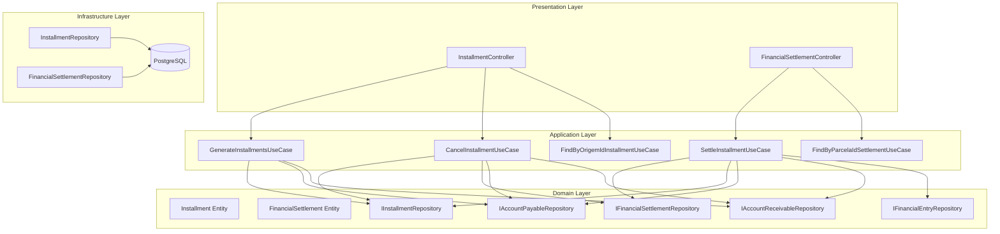
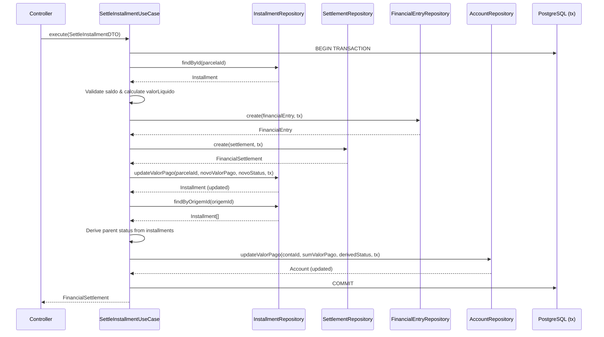

# Design Document: Installment Settlements

## Overview

Este design descreve a implementação do sistema de parcelamento de contas a pagar/receber com baixas financeiras por parcela. O sistema estende os módulos existentes (`installments` e `financial-settlements`) para suportar:

1. **Geração automática de parcelas** a partir de uma conta-pai com distribuição de valores e datas
2. **Baixas financeiras vinculadas a parcelas** (não mais diretamente à conta), com suporte a juros, multa e desconto
3. **Atualização automática da conta-pai** baseada no estado agregado das parcelas
4. **Pagamentos parciais** por parcela com múltiplas baixas até quitação

### Decisões de Design

- **Modificação do `FinancialSettlement`**: A entidade de baixa passa a referenciar `parcelaId` em vez de `contaId`. Isso garante rastreabilidade granular. A coluna `conta_id` na tabela `baixas_financeiras` será substituída por `parcela_id`.
- **Extensão do `Installment`**: A entidade parcela ganha o campo `valorPago` para tracking de progresso.
- **Cálculo de status derivado**: O status da conta-pai é sempre derivado do estado agregado das parcelas, nunca definido manualmente.
- **Transações atômicas**: Toda operação de baixa (criação de lançamento + registro de baixa + atualização de parcela + atualização de conta) ocorre em uma única transação pg-promise.

## Architecture



### Fluxo de Baixa por Parcela



## Components and Interfaces

### Entidade: Installment (Modificada)

```typescript
export class Installment {
  id: string;
  origem: 'PAGAR' | 'RECEBER';
  origemId: string;
  numeroParcela: number;
  totalParcelas: number;
  dataVencimento: Date;
  valor: number;
  valorPago: number;          // NOVO: soma das baixas realizadas
  status: 'PENDENTE' | 'PARCIAL' | 'PAGO' | 'CANCELADO';
  createdAt: Date;
  updatedAt?: Date;
}
```

### Entidade: FinancialSettlement (Modificada)

```typescript
export class FinancialSettlement {
  id: string;
  tipoConta: 'RECEBER' | 'PAGAR';
  parcelaId: string;           // MODIFICADO: era contaId, agora referencia parcela
  valor: number;
  juros: number;               // NOVO
  multa: number;               // NOVO
  desconto: number;            // NOVO
  valorLiquido: number;        // NOVO: valor + juros + multa - desconto
  dataPagamento: Date;
  formaPagamento: string;
  contaBancariaId?: string;
  caixaId?: string;
  lancamentoFinanceiroId: string;
  observacao?: string;
  createdAt: Date;
  updatedAt?: Date;
}
```

### Interface: IInstallmentRepository (Estendida)

```typescript
export interface IInstallmentRepository {
  create(data: any, transaction?: any): Promise<Installment>;
  createMany(data: any[], transaction?: any): Promise<Installment[]>;
  findById(id: string): Promise<Installment | null>;
  findByOrigemId(origemId: string): Promise<Installment[]>;
  updateValorPago(id: string, valorPago: number, status: string, transaction?: any): Promise<Installment>;
  updateStatus(id: string, status: string, transaction?: any): Promise<Installment>;
  hasSettlements(origemId: string): Promise<boolean>;
}
```

### Interface: IFinancialSettlementRepository (Modificada)

```typescript
export interface IFinancialSettlementRepository {
  create(data: any, transaction?: any): Promise<FinancialSettlement>;
  findById(id: string): Promise<FinancialSettlement | null>;
  findByParcelaId(parcelaId: string): Promise<FinancialSettlement[]>;
  existsByParcelaId(parcelaId: string): Promise<boolean>;
}
```

### DTOs

```typescript
// Geração de parcelas
export class GenerateInstallmentsDTO {
  tipoConta: 'PAGAR' | 'RECEBER';
  contaId: string;
  quantidadeParcelas: number;
  intervaloMeses?: number; // default: 1
}

// Baixa por parcela
export class SettleInstallmentDTO {
  parcelaId: string;
  tipoConta: 'PAGAR' | 'RECEBER';
  valor: number;
  juros?: number;       // default: 0
  multa?: number;       // default: 0
  desconto?: number;    // default: 0
  dataPagamento: Date;
  formaPagamento: string;
  contaBancariaId?: string;
  caixaId?: string;
  observacao?: string;
}

// Cancelamento
export class CancelInstallmentDTO {
  parcelaId: string;
}
```

### Use Cases

| Use Case | Input | Output | Descrição |
|----------|-------|--------|-----------|
| `GenerateInstallmentsUseCase` | `GenerateInstallmentsDTO` | `Installment[]` | Gera parcelas a partir de uma conta |
| `SettleInstallmentUseCase` | `SettleInstallmentDTO` | `FinancialSettlement` | Realiza baixa em uma parcela |
| `CancelInstallmentUseCase` | `CancelInstallmentDTO` | `Installment` | Cancela uma parcela sem baixas |
| `FindByOrigemIdInstallmentUseCase` | `origemId: string` | `Installment[]` | Lista parcelas de uma conta |
| `FindByParcelaIdSettlementUseCase` | `parcelaId: string` | `FinancialSettlement[]` | Lista baixas de uma parcela |

### Lógica de Derivação de Status da Conta-Pai

```typescript
function deriveParentStatus(installments: Installment[]): string {
  const activeInstallments = installments.filter(i => i.status !== 'CANCELADO');
  
  if (activeInstallments.length === 0) return 'CANCELADO';
  
  const allPaid = activeInstallments.every(i => i.status === 'PAGO');
  if (allPaid) return tipoConta === 'PAGAR' ? 'PAGO' : 'RECEBIDO';
  
  const anyPaid = activeInstallments.some(i => 
    i.status === 'PAGO' || i.status === 'PARCIAL'
  );
  if (anyPaid) return 'PARCIAL';
  
  return 'PENDENTE';
}
```

## Data Models

### Tabela: `parcelas` (Modificada)

```sql
CREATE TABLE parcelas (
  id UUID PRIMARY KEY DEFAULT gen_random_uuid(),
  origem VARCHAR(10) NOT NULL CHECK (origem IN ('PAGAR', 'RECEBER')),
  origem_id UUID NOT NULL,
  numero_parcela INTEGER NOT NULL,
  total_parcelas INTEGER NOT NULL,
  data_vencimento DATE NOT NULL,
  valor NUMERIC(15, 2) NOT NULL,
  valor_pago NUMERIC(15, 2) NOT NULL DEFAULT 0,
  status VARCHAR(20) NOT NULL DEFAULT 'PENDENTE' 
    CHECK (status IN ('PENDENTE', 'PARCIAL', 'PAGO', 'CANCELADO')),
  created_at TIMESTAMP DEFAULT NOW(),
  updated_at TIMESTAMP,
  
  CONSTRAINT fk_parcela_origem_pagar 
    FOREIGN KEY (origem_id) REFERENCES contas_pagar(id) 
    DEFERRABLE INITIALLY DEFERRED,
  CONSTRAINT fk_parcela_origem_receber 
    FOREIGN KEY (origem_id) REFERENCES contas_receber(id) 
    DEFERRABLE INITIALLY DEFERRED,
  CONSTRAINT chk_valor_pago CHECK (valor_pago <= valor),
  CONSTRAINT chk_valor_positivo CHECK (valor > 0),
  CONSTRAINT chk_numero_parcela CHECK (numero_parcela > 0),
  CONSTRAINT uq_parcela_origem UNIQUE (origem_id, numero_parcela)
);

CREATE INDEX idx_parcelas_origem_id ON parcelas(origem_id);
```

> **Nota sobre FK**: Como `origem_id` pode referenciar tanto `contas_pagar` quanto `contas_receber`, na prática usaremos apenas o índice e a validação será feita na camada de aplicação (padrão já existente no projeto). As constraints de FK acima são ilustrativas.

### Tabela: `baixas_financeiras` (Modificada)

```sql
-- Migration: Substituir conta_id por parcela_id e adicionar campos financeiros
ALTER TABLE baixas_financeiras 
  ADD COLUMN parcela_id UUID,
  ADD COLUMN juros NUMERIC(15, 2) NOT NULL DEFAULT 0,
  ADD COLUMN multa NUMERIC(15, 2) NOT NULL DEFAULT 0,
  ADD COLUMN desconto NUMERIC(15, 2) NOT NULL DEFAULT 0,
  ADD COLUMN valor_liquido NUMERIC(15, 2);

-- Migrar dados existentes (se houver)
-- UPDATE baixas_financeiras SET parcela_id = ... (migração manual necessária)

ALTER TABLE baixas_financeiras 
  DROP COLUMN conta_id,
  ALTER COLUMN parcela_id SET NOT NULL,
  ALTER COLUMN valor_liquido SET NOT NULL;

ALTER TABLE baixas_financeiras 
  ADD CONSTRAINT fk_baixa_parcela FOREIGN KEY (parcela_id) REFERENCES parcelas(id);

CREATE INDEX idx_baixas_parcela_id ON baixas_financeiras(parcela_id);
```

### Schema Final: `baixas_financeiras`

```sql
CREATE TABLE baixas_financeiras (
  id UUID PRIMARY KEY DEFAULT gen_random_uuid(),
  tipo_conta VARCHAR(10) NOT NULL CHECK (tipo_conta IN ('PAGAR', 'RECEBER')),
  parcela_id UUID NOT NULL REFERENCES parcelas(id),
  valor NUMERIC(15, 2) NOT NULL,
  juros NUMERIC(15, 2) NOT NULL DEFAULT 0,
  multa NUMERIC(15, 2) NOT NULL DEFAULT 0,
  desconto NUMERIC(15, 2) NOT NULL DEFAULT 0,
  valor_liquido NUMERIC(15, 2) NOT NULL,
  data_pagamento DATE NOT NULL,
  forma_pagamento VARCHAR(50) NOT NULL,
  conta_bancaria_id UUID,
  caixa_id UUID,
  lancamento_financeiro_id UUID NOT NULL,
  observacao TEXT,
  created_at TIMESTAMP DEFAULT NOW(),
  updated_at TIMESTAMP
);
```

### Modificação na Tabela `parcelas` (Adição de coluna)

```sql
-- Migration: Adicionar valor_pago à tabela parcelas
ALTER TABLE parcelas ADD COLUMN valor_pago NUMERIC(15, 2) NOT NULL DEFAULT 0;
ALTER TABLE parcelas ADD CONSTRAINT chk_valor_pago CHECK (valor_pago <= valor);
```

## Correctness Properties

*A property is a characteristic or behavior that should hold true across all valid executions of a system — essentially, a formal statement about what the system should do. Properties serve as the bridge between human-readable specifications and machine-verifiable correctness guarantees.*

### Property 1: Installment generation preserves total value

*For any* valid account value and number of installments (>= 1), the sum of all generated installment values SHALL equal the original account value exactly.

**Validates: Requirements 1.4**

### Property 2: Installment generation produces correct structure

*For any* valid generation request with N installments, the system SHALL produce exactly N installments with sequential numeroParcela from 1 to N, each with totalParcelas = N, status PENDENTE, valorPago = 0, and monthly-spaced dataVencimento values.

**Validates: Requirements 1.1, 1.2, 1.3, 1.5**

### Property 3: Valor líquido calculation

*For any* settlement with (valor, juros, multa, desconto) where all values are >= 0, the valorLiquido SHALL equal valor + juros + multa - desconto.

**Validates: Requirements 2.2**

### Property 4: Settlement round-trip preserves data

*For any* valid settlement input, creating a settlement and then retrieving it by ID SHALL return a record with all original fields (parcelaId, valor, juros, multa, desconto, valorLiquido, dataPagamento, formaPagamento) preserved, and a corresponding financial entry SHALL exist with valor equal to the valorLiquido.

**Validates: Requirements 2.3, 2.4**

### Property 5: Balance constraint invariant

*For any* installment at any point in time, the valorPago SHALL be less than or equal to the valor of that installment. Any settlement that would cause valorPago to exceed valor SHALL be rejected.

**Validates: Requirements 2.5, 6.3**

### Property 6: Installment status derivation

*For any* installment after a settlement is applied, the status SHALL be PAGO if valorPago equals valor, PARCIAL if valorPago is greater than 0 but less than valor, and PENDENTE if valorPago equals 0.

**Validates: Requirements 2.6, 4.1, 4.3**

### Property 7: Parent account status derivation

*For any* account with installments, the parent account status SHALL be: PENDENTE if no non-cancelled installment has any settlement; PARCIAL if at least one non-cancelled installment has status PARCIAL or PAGO but not all are PAGO; PAGO/RECEBIDO if all non-cancelled installments have status PAGO.

**Validates: Requirements 3.1, 3.2, 3.3, 3.4, 8.3**

### Property 8: Installment valorPago equals sum of settlements

*For any* installment, the valorPago field SHALL equal the sum of valorLiquido of all settlements associated with that installment.

**Validates: Requirements 6.1, 6.2**

### Property 9: Installment query ordering

*For any* set of installments belonging to the same origemId, querying by origemId SHALL return them ordered by numeroParcela in ascending order.

**Validates: Requirements 5.1**

### Property 10: Cancellation of installment without settlements

*For any* installment with status PENDENTE and no associated settlements, canceling it SHALL set its status to CANCELADO. If the installment has any associated settlements, cancellation SHALL be rejected.

**Validates: Requirements 8.1, 8.2**

## Error Handling

### Erros de Validação (HTTP 400)

| Cenário | Mensagem |
|---------|----------|
| Quantidade de parcelas < 1 | "Quantidade de parcelas deve ser maior que zero" |
| Valor líquido excede saldo da parcela | "Valor líquido (R$ X) excede o saldo restante da parcela (R$ Y)" |
| Re-geração com baixas existentes | "Não é possível re-gerar parcelas: existem baixas financeiras vinculadas" |
| Cancelamento com baixas existentes | "Não é possível cancelar parcela: existem baixas financeiras vinculadas" |
| Parcela já quitada | "Parcela já está totalmente quitada" |
| Valores negativos (juros, multa, desconto) | "Valores de juros, multa e desconto devem ser >= 0" |

### Erros de Recurso Não Encontrado (HTTP 404)

| Cenário | Mensagem |
|---------|----------|
| Conta não encontrada | "Conta a pagar/receber não encontrada" |
| Parcela não encontrada | "Parcela não encontrada" |

### Tratamento de Transações

- Todas as operações de escrita usam `connection().tx()` do pg-promise
- Em caso de falha em qualquer etapa, toda a transação é revertida (rollback automático)
- Nenhum estado parcial é persistido em caso de erro
- Erros de constraint do banco (ex: `chk_valor_pago`) são capturados e traduzidos em mensagens amigáveis

## Testing Strategy

### Abordagem Dual: Unit Tests + Property-Based Tests

Este feature é adequado para property-based testing porque:
- Contém lógica pura de cálculo (valor líquido, distribuição de parcelas, derivação de status)
- Possui invariantes universais (soma de parcelas = valor total, valorPago <= valor)
- O espaço de inputs é grande (valores monetários, quantidades de parcelas, sequências de baixas)

### Property-Based Testing

**Biblioteca**: [fast-check](https://github.com/dubzzz/fast-check) (TypeScript)

**Configuração**:
- Mínimo de 100 iterações por propriedade
- Cada teste deve referenciar a propriedade do design document
- Tag format: `Feature: installment-settlements, Property {N}: {title}`

**Propriedades a testar**:
1. Geração preserva valor total (Property 1)
2. Estrutura correta de parcelas geradas (Property 2)
3. Cálculo de valor líquido (Property 3)
4. Round-trip de settlement (Property 4)
5. Invariante de saldo (Property 5)
6. Derivação de status da parcela (Property 6)
7. Derivação de status da conta-pai (Property 7)
8. valorPago = soma dos settlements (Property 8)
9. Ordenação de consulta (Property 9)
10. Cancelamento válido/inválido (Property 10)

### Unit Tests (Example-Based)

Focar em:
- Cenários de erro específicos (parcela não encontrada, conta não encontrada)
- Edge cases de arredondamento (ex: R$ 100,00 / 3 parcelas)
- Integração entre módulos (settlement cria financial entry corretamente)
- Campos opcionais (contaBancariaId, caixaId, observacao como null)
- Resposta inclui juros/multa/desconto (Req 5.4)
- Rastreabilidade parcela → conta (Req 7.3)

### Integration Tests

- Transação completa de baixa com rollback em caso de falha
- Fluxo completo: gerar parcelas → baixar parcela → verificar conta-pai atualizada
- Migração de dados existentes (baixas com conta_id → parcela_id)

### Estrutura de Testes

```
src/modules/finance/installments/src/
  __tests__/
    generate-installments.use-case.spec.ts
    generate-installments.property.spec.ts
    cancel-installment.use-case.spec.ts

src/modules/finance/financial-settlements/src/
  __tests__/
    settle-installment.use-case.spec.ts
    settle-installment.property.spec.ts
    parent-status-derivation.property.spec.ts
```
