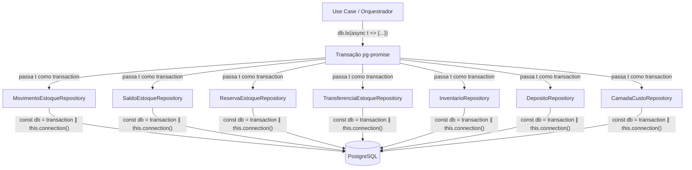
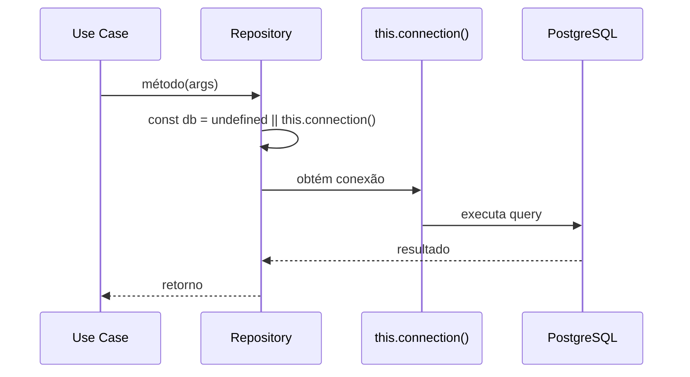
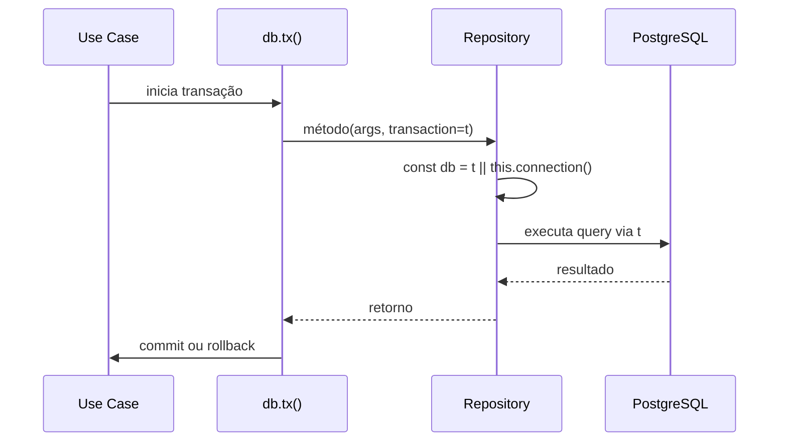

# Design Document: Inventory Control Transactions

## Overview

Esta feature adiciona suporte a transações de banco de dados nos 7 repositórios do módulo de controle de estoque (`inventory-control`). O padrão de implementação é simples e já existe no módulo `product/category`: cada método recebe um parâmetro opcional `transaction?: any` como último argumento e utiliza `const db = transaction || this.connection()` para determinar a conexão de banco de dados.

O caso especial é o `TransferenciaEstoqueRepository.create`, que atualmente usa `db.tx()` internamente para garantir atomicidade. Quando uma transação externa é fornecida, o método deve usar essa transação diretamente, sem criar uma transação interna.

### Decisões de Design

1. **Tipo `any` para transaction**: Mantém consistência com o padrão existente no `CategoryRepository` e evita acoplamento com tipos internos do pg-promise nas interfaces de domínio.
2. **Parâmetro opcional**: Garante compatibilidade retroativa — nenhum código existente precisa ser alterado.
3. **Propagação de erros**: Os repositórios não fazem try/catch nas queries — erros são propagados naturalmente ao chamador, que controla commit/rollback.

## Architecture



### Fluxo sem transação (comportamento atual preservado)



### Fluxo com transação externa



## Components and Interfaces

### Interfaces de Domínio (Alterações)

Todos os 7 repositórios recebem `transaction?: any` como último parâmetro em cada método:

#### IMovimentoEstoqueRepository

```typescript
export interface IMovimentoEstoqueRepository {
  create(movimento: MovimentoEstoque, transaction?: any): Promise<MovimentoEstoque>;
  findByProdutoId(produtoId: string, transaction?: any): Promise<MovimentoEstoque[]>;
  findByOrigem(origem: EstoqueOrigem, origemId: string, transaction?: any): Promise<MovimentoEstoque[]>;
}
```

#### ISaldoEstoqueRepository

```typescript
export interface ISaldoEstoqueRepository {
  upsert(saldo: SaldoEstoque, transaction?: any): Promise<SaldoEstoque>;
  findByProdutoId(produtoId: string, transaction?: any): Promise<SaldoEstoque[]>;
  findByDepositoId(depositoId: string, transaction?: any): Promise<SaldoEstoque[]>;
  findByProdutoAndDeposito(produtoId: string, depositoId: string, transaction?: any): Promise<SaldoEstoque | null>;
}
```

#### IReservaEstoqueRepository

```typescript
export interface IReservaEstoqueRepository {
  create(reserva: ReservaEstoque, transaction?: any): Promise<ReservaEstoque>;
  findByOrigem(origem: EstoqueOrigem, origemId: string, transaction?: any): Promise<ReservaEstoque[]>;
  updateStatus(id: string, status: StatusReservaEstoque, transaction?: any): Promise<ReservaEstoque>;
}
```

#### ITransferenciaEstoqueRepository

```typescript
export interface ITransferenciaEstoqueRepository {
  create(transferencia: TransferenciaEstoque, itens: TransferenciaItem[], transaction?: any): Promise<TransferenciaEstoque>;
  findById(id: string, transaction?: any): Promise<TransferenciaEstoque | null>;
  updateStatus(id: string, status: StatusTransferenciaEstoque, transaction?: any): Promise<TransferenciaEstoque>;
  createItem(item: TransferenciaItem, transaction?: any): Promise<TransferenciaItem>;
  findItensByTransferenciaId(transferenciaId: string, transaction?: any): Promise<TransferenciaItem[]>;
}
```

#### IInventarioRepository

```typescript
export interface IInventarioRepository {
  create(inventario: Inventario, transaction?: any): Promise<Inventario>;
  findById(id: string, transaction?: any): Promise<Inventario | null>;
  finalize(id: string, transaction?: any): Promise<Inventario>;
  update(id: string, data: Partial<Inventario>, transaction?: any): Promise<Inventario>;
  createItem(item: InventarioItem, transaction?: any): Promise<InventarioItem>;
  findItensByInventarioId(inventarioId: string, transaction?: any): Promise<InventarioItem[]>;
  updateItem(item: InventarioItem, transaction?: any): Promise<InventarioItem>;
}
```

#### IDepositoRepository

```typescript
export interface IDepositoRepository {
  create(deposito: Deposito, transaction?: any): Promise<Deposito>;
  findById(id: string, transaction?: any): Promise<Deposito | null>;
  findAll(empresaId: string, transaction?: any): Promise<Deposito[]>;
  update(deposito: Deposito, transaction?: any): Promise<Deposito>;
}
```

#### ICamadaCustoRepository

```typescript
export interface ICamadaCustoRepository {
  create(camada: CamadaCusto, transaction?: any): Promise<CamadaCusto>;
  findByProdutoId(produtoId: string, transaction?: any): Promise<CamadaCusto[]>;
}
```

### Implementações (Padrão de Alteração)

Cada método nas implementações segue o padrão:

```typescript
// Padrão geral (todos os métodos exceto TransferenciaEstoque.create)
async metodo(args..., transaction?: any): Promise<T> {
  const db = transaction || this.connection();
  // ... query usando db ...
}
```

### Caso Especial: TransferenciaEstoqueRepository.create

```typescript
async create(
  transferencia: TransferenciaEstoque,
  itens: TransferenciaItem[],
  transaction?: any,
): Promise<TransferenciaEstoque> {
  if (transaction) {
    // Usa transação externa diretamente
    const row = await transaction.one(/* INSERT transferencia */);
    for (const item of itens) {
      await transaction.none(/* INSERT item */);
    }
    return this.toTransferenciaEntity(row);
  }

  // Sem transação: mantém comportamento atual com db.tx()
  const db = this.connection();
  return db.tx(async (t) => {
    const row = await t.one(/* INSERT transferencia */);
    for (const item of itens) {
      await t.none(/* INSERT item */);
    }
    return this.toTransferenciaEntity(row);
  });
}
```

## Data Models

Não há alterações nos modelos de dados. As entidades e tabelas permanecem inalteradas. A mudança é exclusivamente na camada de acesso a dados (repositórios), adicionando flexibilidade na conexão utilizada para executar queries.

### Repositórios Afetados

| Repositório | Métodos | Padrão |
|---|---|---|
| MovimentoEstoqueRepository | create, findByProdutoId, findByOrigem | `transaction \|\| this.connection()` |
| SaldoEstoqueRepository | upsert, findByProdutoId, findByDepositoId, findByProdutoAndDeposito | `transaction \|\| this.connection()` |
| ReservaEstoqueRepository | create, findByOrigem, updateStatus | `transaction \|\| this.connection()` |
| TransferenciaEstoqueRepository | create*, findById, updateStatus, createItem, findItensByTransferenciaId | `create` usa lógica condicional; demais usam padrão |
| InventarioRepository | create, findById, update, finalize, createItem, findItensByInventarioId, updateItem | `transaction \|\| this.connection()` |
| DepositoRepository | create, findById, findAll, update | `transaction \|\| this.connection()` |
| CamadaCustoRepository | create, findByProdutoId | `transaction \|\| this.connection()` |

**Total: 28 métodos alterados em 7 repositórios.**

## Correctness Properties

*Uma propriedade é uma característica ou comportamento que deve ser verdadeiro em todas as execuções válidas de um sistema — essencialmente, uma declaração formal sobre o que o sistema deve fazer. Propriedades servem como ponte entre especificações legíveis por humanos e garantias de correção verificáveis por máquina.*

### Property 1: Delegação de conexão

*Para qualquer* método de repositório do módulo inventory-control (exceto `TransferenciaEstoqueRepository.create`), quando chamado com um objeto `transaction`, todas as queries daquele método devem ser executadas utilizando o objeto `transaction` fornecido; quando chamado sem `transaction` (undefined), todas as queries devem ser executadas utilizando `this.connection()`.

**Validates: Requirements 1.4, 2.1, 2.2, 2.3, 3.1-3.4, 4.1-4.5, 5.1-5.4, 7.1-7.8, 8.1-8.5, 9.1-9.3, 10.2**

### Property 2: Propagação de erros em transação

*Para qualquer* método de repositório chamado com um objeto `transaction` que lança uma exceção durante a execução da query, o repositório deve propagar essa mesma exceção ao chamador sem interceptá-la, modificá-la ou realizar commit/rollback.

**Validates: Requirements 2.4, 4.6, 5.5, 9.4**

### Property 3: TransferenciaEstoque.create — transação condicional

*Para qualquer* chamada ao método `TransferenciaEstoqueRepository.create`: quando uma transação externa é fornecida, o método NÃO deve invocar `db.tx()` e deve executar todos os INSERTs (transferência + itens) diretamente na transação fornecida; quando nenhuma transação é fornecida, o método deve utilizar `db.tx()` para garantir atomicidade interna.

**Validates: Requirements 6.1, 6.2**

## Error Handling

### Estratégia de Propagação

Os repositórios **não** implementam try/catch nas queries. Erros do pg-promise (conexão perdida, constraint violation, transação encerrada) são propagados naturalmente pela stack de chamadas.

### Cenários de Erro

| Cenário | Comportamento |
|---|---|
| Transação válida, query falha (ex: constraint violation) | Erro propaga ao chamador; chamador decide rollback |
| Transação já encerrada/inválida | pg-promise lança erro; repositório propaga |
| Sem transação, connection() falha | Erro propaga normalmente (comportamento atual) |
| TransferenciaEstoque.create com transação, INSERT falha | Erro propaga; transação externa faz rollback de tudo |

### Responsabilidade de Commit/Rollback

O repositório **nunca** é responsável por commit ou rollback. Essa responsabilidade é do orquestrador (use case) que criou a transação via `db.tx()`.

## Testing Strategy

### Abordagem

A feature é testável com testes unitários usando mocks do pg-promise. O padrão é repetitivo (28 métodos com a mesma lógica), então a estratégia combina:

1. **Testes de propriedade (property-based)**: Verificam as propriedades universais de delegação de conexão
2. **Testes unitários**: Cobrem o caso especial do `TransferenciaEstoqueRepository.create` e edge cases

### Framework

- **Jest** (já configurado no projeto)
- **fast-check** para property-based testing

### Testes de Propriedade

Cada propriedade do design será implementada como um teste property-based com mínimo de 100 iterações:

- **Property 1**: Gerar combinações aleatórias de (repositório, método, presença/ausência de transaction) e verificar qual conexão é utilizada
- **Property 2**: Gerar erros aleatórios e verificar que são propagados sem modificação
- **Property 3**: Testar TransferenciaEstoque.create com e sem transação, verificando se db.tx() é chamado condicionalmente

Tag format: **Feature: inventory-control-transactions, Property {number}: {property_text}**

### Testes Unitários

- Verificar que cada um dos 28 métodos aceita o parâmetro transaction sem erro de compilação
- Testar o caso especial de `TransferenciaEstoqueRepository.create` com transação (não chama `db.tx()`)
- Testar o caso especial de `TransferenciaEstoqueRepository.create` sem transação (chama `db.tx()`)
- Verificar compatibilidade retroativa: chamadas sem transaction continuam funcionando

### Configuração dos Testes de Propriedade

```typescript
// Mínimo 100 iterações por propriedade
fc.assert(
  fc.property(/* arbitraries */, (input) => {
    // verificação da propriedade
  }),
  { numRuns: 100 }
);
```

### Cobertura

| Tipo de Teste | O que cobre |
|---|---|
| Property-based | Delegação universal de conexão, propagação de erros |
| Unit (example) | Caso especial TransferenciaEstoque.create, compilação TypeScript |
| Integration | Transação real com rollback (opcional, requer banco) |
