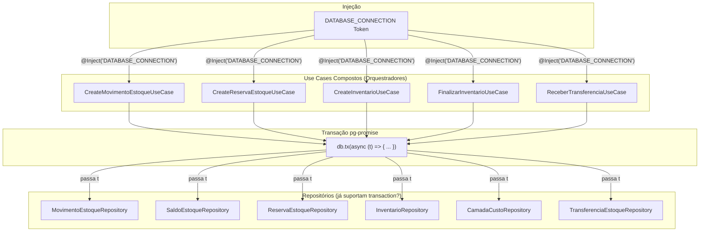
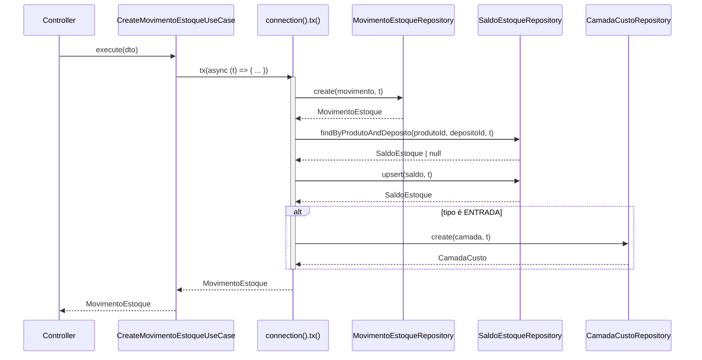
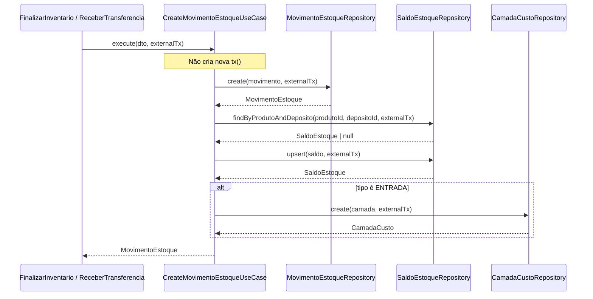
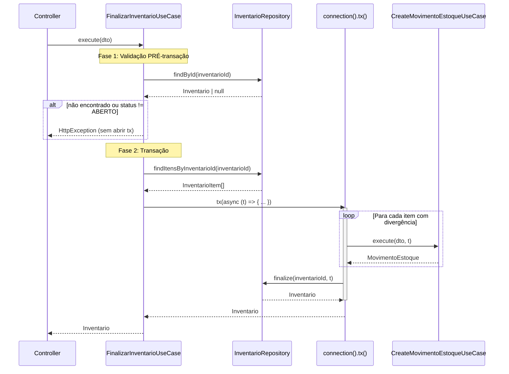
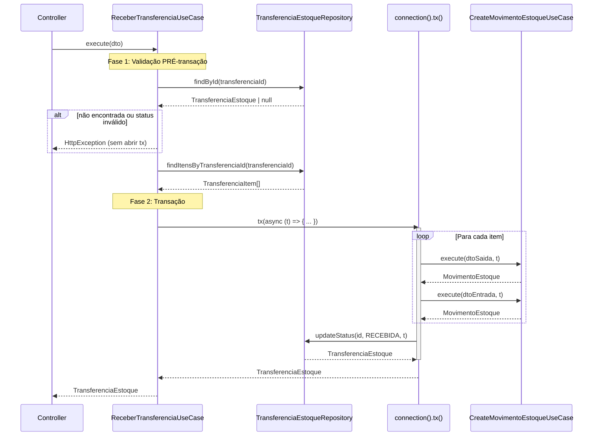

# Design Document: Inventory Control Use Case Transactions

## Overview

Esta feature adiciona orquestração transacional nos use cases compostos do módulo `inventory-control`. Os repositórios já suportam o parâmetro opcional `transaction?: any` (implementado na spec `inventory-control-transactions`). Agora, cada use case que realiza múltiplas operações de escrita injeta o token `DATABASE_CONNECTION` e envolve suas operações em `this.connection().tx(async (t) => { ... })`, passando `t` para cada chamada de repositório.

### Decisões de Design

1. **Padrão accounts-payable**: Segue exatamente o padrão já estabelecido em `CreateAccountPayableUseCase` — injeção de `DATABASE_CONNECTION`, uso de `this.connection().tx()`, passagem do objeto de transação aos repositórios.
2. **Transação externa opcional no CreateMovimentoEstoqueUseCase**: Como este use case é chamado tanto diretamente (controllers) quanto por outros use cases (FinalizarInventario, ReceberTransferencia), ele aceita um parâmetro opcional `transaction?: any`. Quando fornecido, não cria nova transação; quando ausente, cria sua própria via `connection().tx()`.
3. **Validações pré-transação**: FinalizarInventario e ReceberTransferencia executam validações (busca + verificação de status) ANTES de abrir a transação, evitando transações desnecessárias. CreateReservaEstoque executa a leitura DENTRO da transação para evitar race conditions.
4. **Use cases simples inalterados**: `GetSaldoByProdutoUseCase` e `CreateTransferenciaUseCase` não recebem alteração — o primeiro faz apenas leitura simples e o segundo delega atomicidade ao repositório.

## Architecture

### Diagrama Geral — Orquestração Transacional nos Use Cases




### Fluxo: CreateMovimentoEstoqueUseCase (com transação interna)



### Fluxo: CreateMovimentoEstoqueUseCase (com transação externa)



### Fluxo: FinalizarInventarioUseCase (validação pré-transação)



### Fluxo: ReceberTransferenciaUseCase (validação pré-transação)




## Components and Interfaces

### Use Cases Modificados

#### CreateMovimentoEstoqueUseCase (caso especial — transação externa)

```typescript
@Injectable()
export class CreateMovimentoEstoqueUseCase implements BaseUseCase<CreateMovimentoEstoqueDto, MovimentoEstoque> {
  constructor(
    @Inject('IMovimentoEstoqueRepository')
    private readonly movimentoRepository: IMovimentoEstoqueRepository,
    @Inject('ISaldoEstoqueRepository')
    private readonly saldoRepository: ISaldoEstoqueRepository,
    @Inject('ICamadaCustoRepository')
    private readonly camadaCustoRepository: ICamadaCustoRepository,
    @Inject('DATABASE_CONNECTION')
    private readonly connection: any,
  ) {}

  async execute(data: CreateMovimentoEstoqueDto, transaction?: any): Promise<MovimentoEstoque> {
    const operation = async (t: any) => {
      const movimento = new MovimentoEstoque({ /* ... campos ... */ });
      const createdMovimento = await this.movimentoRepository.create(movimento, t);

      let saldo = await this.saldoRepository.findByProdutoAndDeposito(
        data.produtoId, data.depositoId, t,
      );

      // ... lógica de cálculo de saldo ...

      await this.saldoRepository.upsert(saldo, t);

      if (isEntrada) {
        const camada = new CamadaCusto({ /* ... */ });
        await this.camadaCustoRepository.create(camada, t);
      }

      return createdMovimento;
    };

    // Se transação externa fornecida, usa diretamente; senão, cria nova
    if (transaction) {
      return operation(transaction);
    }
    return this.connection().tx(operation);
  }
}
```

#### CreateReservaEstoqueUseCase

```typescript
@Injectable()
export class CreateReservaEstoqueUseCase implements BaseUseCase<CreateReservaEstoqueDto, ReservaEstoque> {
  constructor(
    @Inject('IReservaEstoqueRepository')
    private readonly reservaRepository: IReservaEstoqueRepository,
    @Inject('ISaldoEstoqueRepository')
    private readonly saldoRepository: ISaldoEstoqueRepository,
    @Inject('DATABASE_CONNECTION')
    private readonly connection: any,
  ) {}

  async execute(data: CreateReservaEstoqueDto): Promise<ReservaEstoque> {
    return this.connection().tx(async (t) => {
      // Leitura DENTRO da transação (evita race condition)
      const saldo = await this.saldoRepository.findByProdutoAndDeposito(
        data.produtoId, data.depositoId, t,
      );

      if (!saldo) {
        throw new HttpException('Saldo não encontrado...', HttpStatus.NOT_FOUND);
      }

      if (saldo.disponivel < data.quantidade) {
        throw new HttpException('Saldo disponível insuficiente...', HttpStatus.BAD_REQUEST);
      }

      const reserva = new ReservaEstoque({ /* ... */ });
      const createdReserva = await this.reservaRepository.create(reserva, t);

      saldo.reservado = saldo.reservado + data.quantidade;
      saldo.updatedAt = new Date();
      await this.saldoRepository.upsert(saldo, t);

      return createdReserva;
    });
  }
}
```

#### CreateInventarioUseCase

```typescript
@Injectable()
export class CreateInventarioUseCase implements BaseUseCase<CreateInventarioDto, Inventario> {
  constructor(
    @Inject('IInventarioRepository')
    private readonly inventarioRepository: IInventarioRepository,
    @Inject('ISaldoEstoqueRepository')
    private readonly saldoRepository: ISaldoEstoqueRepository,
    @Inject('DATABASE_CONNECTION')
    private readonly connection: any,
  ) {}

  async execute(data: CreateInventarioDto): Promise<Inventario> {
    return this.connection().tx(async (t) => {
      const inventario = new Inventario({ /* ... */ });
      const createdInventario = await this.inventarioRepository.create(inventario, t);

      const saldos = await this.saldoRepository.findByDepositoId(data.depositoId, t);

      for (const saldo of saldos) {
        const item = new InventarioItem({ /* ... */ });
        await this.inventarioRepository.createItem(item, t);
      }

      return createdInventario;
    });
  }
}
```

#### FinalizarInventarioUseCase

```typescript
@Injectable()
export class FinalizarInventarioUseCase implements BaseUseCase<FinalizarInventarioDto, Inventario> {
  constructor(
    @Inject('IInventarioRepository')
    private readonly inventarioRepository: IInventarioRepository,
    private readonly createMovimentoEstoqueUseCase: CreateMovimentoEstoqueUseCase,
    @Inject('DATABASE_CONNECTION')
    private readonly connection: any,
  ) {}

  async execute(data: FinalizarInventarioDto): Promise<Inventario> {
    // Fase 1: Validação PRÉ-transação
    const inventario = await this.inventarioRepository.findById(data.inventarioId);

    if (!inventario) {
      throw new HttpException('Inventário não encontrado', HttpStatus.NOT_FOUND);
    }

    if (inventario.status !== 'ABERTO') {
      throw new HttpException('Inventário não está com status ABERTO', HttpStatus.BAD_REQUEST);
    }

    const itens = await this.inventarioRepository.findItensByInventarioId(data.inventarioId);

    // Fase 2: Transação
    return this.connection().tx(async (t) => {
      for (const item of itens) {
        const divergencia = item.divergencia;
        if (divergencia === 0) continue;

        const tipo = divergencia > 0
          ? EstoqueTipoMovimento.AJUSTE_POSITIVO
          : EstoqueTipoMovimento.AJUSTE_NEGATIVO;

        await this.createMovimentoEstoqueUseCase.execute({
          produtoId: item.produtoId,
          depositoId: inventario.depositoId,
          tipo,
          origem: EstoqueOrigem.INVENTARIO,
          origemId: data.inventarioId,
          quantidade: Math.abs(divergencia),
          custoUnitario: 0,
        }, t); // <-- passa transação externa
      }

      const finalizado = await this.inventarioRepository.finalize(data.inventarioId, t);
      return finalizado;
    });
  }
}
```

#### ReceberTransferenciaUseCase

```typescript
@Injectable()
export class ReceberTransferenciaUseCase implements BaseUseCase<ReceberTransferenciaDto, TransferenciaEstoque> {
  constructor(
    @Inject('ITransferenciaEstoqueRepository')
    private readonly transferenciaRepository: ITransferenciaEstoqueRepository,
    private readonly createMovimentoEstoqueUseCase: CreateMovimentoEstoqueUseCase,
    @Inject('DATABASE_CONNECTION')
    private readonly connection: any,
  ) {}

  async execute(data: ReceberTransferenciaDto): Promise<TransferenciaEstoque> {
    // Fase 1: Validação PRÉ-transação
    const transferencia = await this.transferenciaRepository.findById(data.transferenciaId);

    if (!transferencia) {
      throw new HttpException('Transferência não encontrada', HttpStatus.NOT_FOUND);
    }

    if (
      transferencia.status !== StatusTransferenciaEstoque.EM_TRANSITO &&
      transferencia.status !== StatusTransferenciaEstoque.SEPARADA
    ) {
      throw new HttpException(
        'Transferência não está em trânsito ou separada para ser recebida',
        HttpStatus.BAD_REQUEST,
      );
    }

    const itens = await this.transferenciaRepository.findItensByTransferenciaId(
      data.transferenciaId,
    );

    // Fase 2: Transação
    return this.connection().tx(async (t) => {
      for (const item of itens) {
        await this.createMovimentoEstoqueUseCase.execute({
          produtoId: item.produtoId,
          depositoId: transferencia.depositoOrigemId,
          tipo: EstoqueTipoMovimento.TRANSFERENCIA_SAIDA,
          origem: EstoqueOrigem.TRANSFERENCIA,
          origemId: data.transferenciaId,
          quantidade: item.quantidade,
          custoUnitario: 0,
        }, t);

        await this.createMovimentoEstoqueUseCase.execute({
          produtoId: item.produtoId,
          depositoId: transferencia.depositoDestinoId,
          tipo: EstoqueTipoMovimento.TRANSFERENCIA_ENTRADA,
          origem: EstoqueOrigem.TRANSFERENCIA,
          origemId: data.transferenciaId,
          quantidade: item.quantidade,
          custoUnitario: 0,
        }, t);
      }

      const updatedTransferencia = await this.transferenciaRepository.updateStatus(
        data.transferenciaId,
        StatusTransferenciaEstoque.RECEBIDA,
        t,
      );

      return updatedTransferencia;
    });
  }
}
```

### Use Cases NÃO Modificados

| Use Case | Motivo |
|---|---|
| `GetSaldoByProdutoUseCase` | Apenas leitura simples (uma chamada a repositório) |
| `CreateTransferenciaUseCase` | Delega atomicidade ao `TransferenciaEstoqueRepository.create` que já gerencia sua própria transação interna |


## Data Models

Não há alterações nos modelos de dados (entidades ou tabelas). A mudança é exclusivamente na camada de aplicação (use cases), adicionando orquestração transacional sobre os repositórios que já suportam o parâmetro `transaction`.

### Resumo de Alterações por Use Case

| Use Case | Injeção DATABASE_CONNECTION | Transação | Transação Externa | Validação Pré-TX |
|---|---|---|---|---|
| CreateMovimentoEstoqueUseCase | ✅ | `connection().tx()` ou usa externa | ✅ (parâmetro opcional) | Não |
| CreateReservaEstoqueUseCase | ✅ | `connection().tx()` | Não | Não (leitura dentro da TX) |
| CreateInventarioUseCase | ✅ | `connection().tx()` | Não | Não |
| FinalizarInventarioUseCase | ✅ | `connection().tx()` | Não (orquestrador) | ✅ (findById + status) |
| ReceberTransferenciaUseCase | ✅ | `connection().tx()` | Não (orquestrador) | ✅ (findById + status) |
| GetSaldoByProdutoUseCase | ❌ | Nenhuma | Não | N/A |
| CreateTransferenciaUseCase | ❌ | Nenhuma (repo gerencia) | Não | N/A |

### Padrão de Transação Condicional (CreateMovimentoEstoqueUseCase)

```typescript
// Extrai a lógica em uma função interna
const operation = async (t: any) => { /* ... todas as operações com t ... */ };

// Decisão: usar transação externa ou criar nova
if (transaction) {
  return operation(transaction);
}
return this.connection().tx(operation);
```

Este padrão garante:
- **Reutilização**: A mesma lógica é executada independentemente da origem da transação
- **Atomicidade**: Quando chamado diretamente, cria sua própria transação
- **Composição**: Quando chamado por orquestradores, participa da transação externa

## Correctness Properties

*Uma propriedade é uma característica ou comportamento que deve ser verdadeiro em todas as execuções válidas de um sistema — essencialmente, uma declaração formal sobre o que o sistema deve fazer. Propriedades servem como ponte entre especificações legíveis por humanos e garantias de correção verificáveis por máquina.*

### Property 1: Orquestração transacional — todos os repositórios recebem a transação

*Para qualquer* use case composto (CreateMovimentoEstoque, CreateReservaEstoque, CreateInventario, FinalizarInventario, ReceberTransferencia) e *para qualquer* input válido ao método `execute`, todas as chamadas a métodos de repositório dentro do escopo transacional devem receber o mesmo objeto de transação `t` obtido via `connection().tx()`.

**Validates: Requirements 2.1, 2.2, 3.1, 3.2, 4.1, 4.2, 5.1, 5.2, 6.1, 6.2**

### Property 2: Delegação de transação externa no CreateMovimentoEstoqueUseCase

*Para qualquer* input válido ao `CreateMovimentoEstoqueUseCase.execute`: quando uma transação externa é fornecida como segundo parâmetro, todas as chamadas de repositório devem receber essa transação externa e `connection().tx()` NÃO deve ser invocado; quando nenhuma transação é fornecida, `connection().tx()` deve ser invocado e o objeto de transação resultante deve ser passado a todos os repositórios.

**Validates: Requirements 5.3, 5.4, 5.7, 7.1, 7.2, 7.3**

### Property 3: Propagação de erros sem interceptação

*Para qualquer* use case composto executando dentro de `db.tx()`, se qualquer chamada de repositório lançar uma exceção, essa exceção deve propagar-se para fora do callback da transação sem ser capturada, permitindo que o pg-promise execute rollback automático. Nenhuma operação anterior da mesma transação deve ser observável após a falha.

**Validates: Requirements 2.3, 3.3, 4.3, 5.5, 6.3, 7.5, 7.6**

### Property 4: Validação pré-transação evita abertura de transação

*Para qualquer* input ao `FinalizarInventarioUseCase` ou `ReceberTransferenciaUseCase` que falhe na validação (entidade não encontrada ou status inválido), `connection().tx()` NÃO deve ser invocado — a exceção deve ser lançada antes de qualquer abertura de transação.

**Validates: Requirements 8.1, 8.2, 8.4**

### Property 5: Lógica condicional de camada de custo

*Para qualquer* input ao `CreateMovimentoEstoqueUseCase` cujo tipo de movimento NÃO pertence à lista `TIPOS_ENTRADA`, a transação deve conter apenas a criação do movimento e o upsert do saldo, sem invocar `camadaCustoRepository.create()`. Conversamente, para qualquer tipo de movimento que pertence a `TIPOS_ENTRADA`, `camadaCustoRepository.create()` deve ser invocado dentro da mesma transação.

**Validates: Requirements 2.5**

### Property 6: Invariante de retorno independente do modo de transação

*Para qualquer* input válido ao `CreateMovimentoEstoqueUseCase`, o tipo de retorno deve ser `MovimentoEstoque` com todos os campos preenchidos, independentemente de a execução ter ocorrido com transação interna (criada pelo próprio use case) ou com transação externa (fornecida por orquestrador).

**Validates: Requirements 2.4, 5.6, 7.4, 9.1**


## Error Handling

### Estratégia por Fase

| Fase | Comportamento |
|---|---|
| Validação pré-transação (FinalizarInventario, ReceberTransferencia) | Lança `HttpException` imediatamente, sem abrir transação |
| Validação dentro da transação (CreateReservaEstoque) | Lança `HttpException` dentro do `tx()`, causando rollback automático |
| Erro de repositório dentro de `tx()` | Erro propaga naturalmente, pg-promise faz rollback |
| Erro de repositório com transação externa | Erro propaga ao orquestrador, que controla o rollback via seu próprio `tx()` |

### Cenários de Erro Detalhados

| Use Case | Cenário | Resultado |
|---|---|---|
| CreateMovimentoEstoque (interno) | `movimentoRepository.create` falha | Rollback automático, nenhum saldo/camada criado |
| CreateMovimentoEstoque (interno) | `saldoRepository.upsert` falha | Rollback automático, movimento criado é revertido |
| CreateMovimentoEstoque (externo) | Qualquer repo falha | Erro propaga ao orquestrador, rollback é responsabilidade do orquestrador |
| CreateReservaEstoque | Saldo insuficiente | `HttpException` dentro de tx(), rollback automático |
| CreateReservaEstoque | `reservaRepository.create` falha | Rollback automático |
| CreateInventarioUseCase | `createItem` falha no 3º item | Rollback automático, inventário e itens 1-2 revertidos |
| FinalizarInventarioUseCase | Inventário não encontrado | `HttpException` SEM abrir transação |
| FinalizarInventarioUseCase | 2º movimento falha | Rollback automático, 1º movimento e finalize revertidos |
| ReceberTransferenciaUseCase | Transferência não em trânsito | `HttpException` SEM abrir transação |
| ReceberTransferenciaUseCase | Movimento de entrada falha | Rollback automático, movimento de saída revertido |

### Princípios

1. **Use cases NÃO fazem try/catch dentro do `tx()`** — erros propagam naturalmente para o pg-promise gerenciar rollback
2. **Validações que não dependem de estado transacional** são executadas ANTES de `tx()` para evitar transações desnecessárias
3. **Validações que dependem de leitura consistente** (CreateReservaEstoque) são executadas DENTRO de `tx()` para evitar race conditions
4. **CreateMovimentoEstoqueUseCase com transação externa** nunca faz commit/rollback — delega ao orquestrador

## Testing Strategy

### Abordagem Dual

A feature é testável com uma combinação de:

1. **Testes de propriedade (property-based)**: Verificam as propriedades universais de orquestração transacional
2. **Testes unitários (example-based)**: Cobrem cenários específicos, edge cases e validações

### Framework

- **Jest** (já configurado no projeto)
- **fast-check** para property-based testing (biblioteca de PBT para TypeScript/JavaScript)

### Testes de Propriedade

Cada propriedade do design será implementada como um teste property-based com mínimo de 100 iterações:

- **Property 1 (Orquestração transacional)**: Gerar DTOs aleatórios para cada use case, mockar `connection().tx()` para capturar o objeto `t`, verificar que todas as chamadas de repositório recebem `t` como último argumento.
- **Property 2 (Delegação de transação externa)**: Gerar DTOs aleatórios + presença/ausência de transação externa, verificar que `connection().tx()` é chamado condicionalmente e que repos recebem a transação correta.
- **Property 3 (Propagação de erros)**: Gerar DTOs aleatórios + ponto de falha aleatório (qual repositório falha), verificar que o erro propaga sem ser capturado.
- **Property 4 (Validação pré-transação)**: Gerar inputs inválidos (id inexistente, status errado) para FinalizarInventario e ReceberTransferencia, verificar que `connection().tx()` nunca é chamado.
- **Property 5 (Camada de custo condicional)**: Gerar tipos de movimento aleatórios, verificar que `camadaCustoRepository.create` é chamado se e somente se o tipo pertence a `TIPOS_ENTRADA`.
- **Property 6 (Invariante de retorno)**: Gerar DTOs aleatórios com e sem transação externa, verificar que o retorno tem a mesma estrutura `MovimentoEstoque`.

Tag format: **Feature: inventory-control-use-case-transactions, Property {number}: {property_text}**

### Testes Unitários (Example-Based)

| Cenário | Use Case | O que verifica |
|---|---|---|
| Injeção de DATABASE_CONNECTION | Todos os 5 compostos | Construtor aceita o token sem erro |
| Validação pré-TX: inventário não encontrado | FinalizarInventario | Lança NOT_FOUND sem chamar tx() |
| Validação pré-TX: status != ABERTO | FinalizarInventario | Lança BAD_REQUEST sem chamar tx() |
| Validação pré-TX: transferência não encontrada | ReceberTransferencia | Lança NOT_FOUND sem chamar tx() |
| Validação pré-TX: status inválido | ReceberTransferencia | Lança BAD_REQUEST sem chamar tx() |
| Validação dentro TX: saldo não encontrado | CreateReservaEstoque | Lança NOT_FOUND (rollback implícito) |
| Validação dentro TX: saldo insuficiente | CreateReservaEstoque | Lança BAD_REQUEST (rollback implícito) |
| Compatibilidade: chamada sem transaction | CreateMovimentoEstoque | Mesmo retorno e efeitos que antes |

### Configuração dos Testes de Propriedade

```typescript
import fc from 'fast-check';

// Mínimo 100 iterações por propriedade
fc.assert(
  fc.property(
    arbitraryCreateMovimentoDto(),
    fc.boolean(), // com ou sem transação externa
    async (dto, hasExternalTx) => {
      // ... verificação da propriedade ...
    }
  ),
  { numRuns: 100 }
);
```

### Estratégia de Mocking

```typescript
// Mock do connection para capturar chamadas tx()
const mockTransaction = {};
const mockTx = jest.fn((callback) => callback(mockTransaction));
const mockConnection = jest.fn(() => ({ tx: mockTx }));

// Mock dos repositórios para verificar parâmetro transaction
const mockMovimentoRepo = {
  create: jest.fn().mockResolvedValue(mockMovimento),
};

// Verificação: repo recebeu a transação
expect(mockMovimentoRepo.create).toHaveBeenCalledWith(
  expect.any(Object),
  mockTransaction, // <-- verifica que recebeu t
);
```

### Cobertura

| Tipo de Teste | O que cobre |
|---|---|
| Property-based | Orquestração universal, delegação de transação, propagação de erros, lógica condicional |
| Unit (example) | Validações de negócio, edge cases, cenários de erro específicos |
| Smoke | Injeção de dependência, compilação TypeScript |
