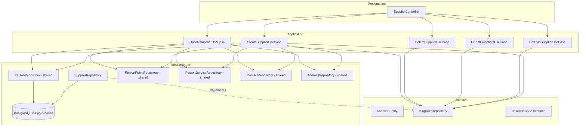

# Design Document: Supplier Module

## Overview

O módulo de Fornecedor (Supplier) implementa operações CRUD completas seguindo Clean Architecture em quatro camadas: domain, application, infra e presentation. O módulo segue exatamente o mesmo padrão arquitetural do módulo de Cliente, adaptado para os campos específicos do fornecedor (`categoria`, `prazoEntregaDias`) e a tabela `fornecedor` no banco de dados.

O fornecedor é uma extensão da entidade Pessoa, compartilhando os repositórios de pessoa (Person, PersonFisica, PersonJuridica, Contact, Address) e utilizando transações pg-promise para garantir consistência atômica entre criação/atualização de pessoa e fornecedor.

### Decisões de Design

- **Reutilização do padrão Client**: Toda a estrutura de camadas, injeção de dependência e orquestração transacional segue o ClientModule como referência direta.
- **Soft delete via pessoa**: A exclusão lógica é feita na tabela `pessoa` (campo `ativo = false`), não na tabela `fornecedor`, mantendo consistência com o padrão existente.
- **Repositórios compartilhados**: Os repositórios de Person, PersonFisica, PersonJuridica, Contact e Address são reutilizados via tokens de DI, sem duplicação.
- **Validação na borda**: DTOs com class-validator garantem que dados inválidos são rejeitados antes de chegar à camada de aplicação.

## Architecture



### Fluxo de Dados

1. **Request** → Controller recebe e valida DTO via class-validator/class-transformer
2. **Controller** → Delega para o Use Case correspondente
3. **Use Case** → Orquestra repositórios dentro de transação (create/update) ou chamada direta (find/delete)
4. **Repository** → Executa queries SQL via pg-promise contra PostgreSQL
5. **Response** → Use Case retorna dados ao Controller que responde ao cliente HTTP

## Components and Interfaces

### Domain Layer

#### Supplier Entity
```typescript
// src/modules/person/supplier/src/domain/entity/supplier.entity.ts
export class Supplier {
  id?: string;
  personId: string;
  categoria?: string;
  prazoEntregaDias?: number;
}
```

#### ISupplierRepository Interface
```typescript
// src/modules/person/supplier/src/domain/repository/supplier.interface.repository.ts
import { Supplier } from '../entity/supplier.entity';

export interface ISupplierRepository {
  create(data: any, transaction?: any): Promise<Supplier>;
  findById(id: string): Promise<any | null>;
  findAll(page: number, limit: number): Promise<{ data: any[]; total: number }>;
  update(id: string, data: any, transaction?: any): Promise<any>;
  delete(id: string): Promise<void>;
}
```

#### BaseUseCase Interface
```typescript
// src/modules/person/supplier/src/domain/use-case/base.use-case.ts
export interface BaseUseCase<I, O> {
  execute(data: I): Promise<O>;
}
```

### Application Layer

#### DTOs

**SupplierDataDTO** (campos específicos do fornecedor):
```typescript
// src/modules/person/supplier/src/application/dto/supplier.dto.ts
export class SupplierDataDTO {
  @IsOptional()
  @IsString({ message: 'O campo categoria deve ser uma string' })
  @MaxLength(100, { message: 'O campo categoria deve ter no máximo 100 caracteres' })
  categoria?: string;

  @IsOptional()
  @IsInt({ message: 'O campo prazoEntregaDias deve ser um número inteiro' })
  @Min(0, { message: 'O campo prazoEntregaDias deve ser no mínimo 0' })
  @Max(365, { message: 'O campo prazoEntregaDias deve ser no máximo 365' })
  prazoEntregaDias?: number;
}
```

**CreateSupplierDTO**:
```typescript
// src/modules/person/supplier/src/application/dto/create-supplier.dto.ts
export class CreateSupplierDTO {
  @ValidateNested()
  @Type(() => CreatePersonDTO)
  pessoa: CreatePersonDTO;

  @ValidateNested()
  @Type(() => SupplierDataDTO)
  fornecedor: SupplierDataDTO;
}
```

**UpdateSupplierDTO**:
```typescript
// src/modules/person/supplier/src/application/dto/update-supplier.dto.ts
export class UpdateSupplierDTO {
  @IsOptional()
  @ValidateNested()
  @Type(() => UpdateSupplierPessoaDTO)
  pessoa?: UpdateSupplierPessoaDTO;

  @IsOptional()
  @ValidateNested()
  @Type(() => SupplierDataDTO)
  fornecedor?: SupplierDataDTO;
}
```

**PaginationQueryDTO** (reutilizado do client):
```typescript
// src/modules/person/supplier/src/application/dto/pagination-query.dto.ts
export class PaginationQueryDTO {
  @IsOptional() @IsInt() @Min(1) page?: number = 1;
  @IsOptional() @IsInt() @Min(1) @Max(100) limit?: number = 10;
}
```

#### Use Cases

| Use Case | Input | Output | Transacional |
|----------|-------|--------|:------------:|
| CreateSupplierUseCase | CreateSupplierDTO | Person (created) | Sim |
| GetByIdSupplierUseCase | { id: string } | Supplier + Person data | Não |
| FindAllSuppliersUseCase | PaginationQueryDTO | { data, meta } | Não |
| UpdateSupplierUseCase | { id, updateData } | Supplier completo | Sim |
| DeleteSupplierUseCase | { id: string } | void | Não |

### Infrastructure Layer

#### SupplierRepository
```typescript
// src/modules/person/supplier/src/infra/repository/supplier.repository.ts
export class SupplierRepository implements ISupplierRepository {
  constructor(@Inject('DATABASE_CONNECTION') private readonly connection: any) {}

  // create: INSERT INTO fornecedor (pessoa_id, categoria, prazo_entrega_dias)
  // findById: SELECT com INNER JOIN pessoa WHERE ativo = true
  // findAll: SELECT com INNER JOIN pessoa WHERE ativo = true ORDER BY nome ASC LIMIT/OFFSET
  // update: UPDATE fornecedor SET categoria, prazo_entrega_dias WHERE id
  // delete: UPDATE pessoa SET ativo = false WHERE id = (SELECT pessoa_id FROM fornecedor WHERE id)
}
```

### Presentation Layer

#### SupplierController
```typescript
// src/modules/person/supplier/src/presentation/controllers/supplier.controller.ts
@Controller('supplier')
export class SupplierController {
  // GET /supplier/:id → getByIdSupplierUseCase
  // GET /supplier → findAllSuppliersUseCase (com PaginationQueryDTO)
  // POST /supplier → createSupplierUseCase
  // PUT /supplier/:id → updateSupplierUseCase
  // DELETE /supplier/:id → deleteSupplierUseCase (HttpCode 204)
}
```

### Module Registration

```typescript
// src/modules/person/supplier/src/supplier.module.ts
@Module({
  controllers: [SupplierController],
  providers: [
    { provide: 'ISupplierRepository', useClass: SupplierRepository },
    { provide: 'IPersonRepository', useClass: PersonRepository },
    { provide: 'IPersonFisicaRepository', useClass: PersonFisicaRepository },
    { provide: 'IPersonJuridicaRepository', useClass: PersonJuridicaRepository },
    { provide: 'IContactRepository', useClass: ContactRepository },
    { provide: 'IAddressRepository', useClass: AddressRepository },
    CreateSupplierUseCase,
    GetByIdSupplierUseCase,
    FindAllSuppliersUseCase,
    UpdateSupplierUseCase,
    DeleteSupplierUseCase,
  ],
})
export class SupplierModule {}
```

## Data Models

### Tabela: fornecedor

| Coluna | Tipo | Constraints |
|--------|------|-------------|
| id | UUID | PK, DEFAULT uuid_generate_v4() |
| pessoa_id | UUID | FK → pessoa(id), NOT NULL |
| categoria | VARCHAR(100) | NULLABLE |
| prazo_entrega_dias | INTEGER | NULLABLE, CHECK (0-365) |

### Tabela: pessoa (compartilhada)

| Coluna | Tipo | Constraints |
|--------|------|-------------|
| id | UUID | PK |
| nome | VARCHAR | NOT NULL |
| email | VARCHAR | NULLABLE |
| tipo | CHAR(1) | 'F' ou 'J' |
| ativo | BOOLEAN | DEFAULT true |
| fornecedor | INTEGER | Flag indicando que é fornecedor |
| observacao | TEXT | NULLABLE |
| cadastro | TIMESTAMP | DEFAULT NOW() |

### Mapeamento Entity ↔ Database

| Entity Field | DB Column | Transformação |
|-------------|-----------|---------------|
| id | id | direto |
| personId | pessoa_id | camelCase → snake_case |
| categoria | categoria | direto |
| prazoEntregaDias | prazo_entrega_dias | camelCase → snake_case |

### Queries SQL Principais

**CREATE:**
```sql
INSERT INTO fornecedor (pessoa_id, categoria, prazo_entrega_dias)
VALUES ($1, $2, $3) RETURNING *
```

**FIND BY ID:**
```sql
SELECT f.id, f.pessoa_id, f.categoria, f.prazo_entrega_dias, p.nome, p.email, p.tipo
FROM fornecedor f
INNER JOIN pessoa p ON p.id = f.pessoa_id
WHERE f.id = $1 AND p.ativo = true
```

**FIND ALL (paginado):**
```sql
SELECT f.id, f.pessoa_id, f.categoria, f.prazo_entrega_dias, p.nome, p.email, p.tipo
FROM fornecedor f
INNER JOIN pessoa p ON p.id = f.pessoa_id
WHERE p.ativo = true
ORDER BY p.nome ASC
LIMIT $1 OFFSET $2
```

**COUNT:**
```sql
SELECT COUNT(*) as total
FROM fornecedor f
INNER JOIN pessoa p ON p.id = f.pessoa_id
WHERE p.ativo = true
```

**UPDATE:**
```sql
UPDATE fornecedor
SET categoria = COALESCE($2, categoria),
    prazo_entrega_dias = COALESCE($3, prazo_entrega_dias)
WHERE id = $1
RETURNING *
```

**DELETE (soft):**
```sql
UPDATE pessoa
SET ativo = false
WHERE id = (SELECT pessoa_id FROM fornecedor WHERE id = $1)
```

## Correctness Properties

*A property is a characteristic or behavior that should hold true across all valid executions of a system—essentially, a formal statement about what the system should do. Properties serve as the bridge between human-readable specifications and machine-verifiable correctness guarantees.*

### Property 1: Creation orchestrates all sub-records based on payload content

*For any* valid CreateSupplierDTO, the create use case SHALL call personRepository.create with `fornecedor: 1` flag, supplierRepository.create with the supplier-specific fields, and conditionally call personFisicaRepository (when tipo="F" and fisica present), personJuridicaRepository (when tipo="J" and juridica present), contactRepository (for each contact), and addressRepository (for each address) — all within the same transaction.

**Validates: Requirements 1.1, 1.2, 1.3, 1.4, 1.5, 1.8, 1.9**

### Property 2: Transaction rollback on creation failure

*For any* valid CreateSupplierDTO and any failure point during the transaction, if any repository call throws an error, the transaction SHALL be rolled back and no partial data SHALL be persisted.

**Validates: Requirements 1.6**

### Property 3: Create DTO validation rejects invalid payloads

*For any* CreateSupplierDTO payload where required fields are missing or field values violate constraints (nome empty, tipo not in ['F','J'], categoria > 100 chars, prazoEntregaDias outside [0,365]), the system SHALL reject the request with validation error messages.

**Validates: Requirements 1.7, 6.1, 6.2, 6.3, 6.4, 6.5**

### Property 4: FindById returns correct supplier data for active suppliers

*For any* supplier ID that exists in the repository with an active associated person, the getById use case SHALL return the supplier data including id, pessoa_id, categoria, prazo_entrega_dias, nome, email, and tipo. For any ID that does not exist or whose person is inactive, it SHALL throw NotFoundException.

**Validates: Requirements 2.1, 2.2**

### Property 5: Pagination meta calculation is correct

*For any* total count of active suppliers and any valid page/limit combination, the findAll use case SHALL return meta with `totalPages = Math.ceil(total / limit)`, correct `page` and `limit` values, and data array with at most `limit` elements.

**Validates: Requirements 3.2, 3.3, 3.7**

### Property 6: Pagination DTO validation rejects invalid parameters

*For any* page value less than 1 or limit value outside [1, 100], the system SHALL reject the request with a validation error message indicating the invalid field.

**Validates: Requirements 3.6**

### Property 7: Update orchestrates partial updates within a transaction

*For any* valid UpdateSupplierDTO with an existing supplier ID, the update use case SHALL: update only the fornecedor fields when `fornecedor` is provided, update person fields when `pessoa` is provided, delete and recreate contacts when `pessoa.contatos` is provided, delete and recreate addresses when `pessoa.enderecos` is provided — all within a single transaction.

**Validates: Requirements 4.1, 4.2, 4.6**

### Property 8: Update DTO validation rejects invalid payloads

*For any* UpdateSupplierDTO payload where provided field values violate constraints (categoria > 100 chars, prazoEntregaDias outside [0,365], invalid email format), the system SHALL reject the request with status 400 and validation error messages.

**Validates: Requirements 4.3, 4.4, 6.6**

### Property 9: Soft delete sets pessoa.ativo to false

*For any* existing supplier ID, the delete use case SHALL set the associated person's `ativo` field to false without physically removing any records. For any non-existent supplier ID, it SHALL throw NotFoundException.

**Validates: Requirements 5.1, 5.2, 5.3**

### Property 10: Supplier-specific field validation boundaries

*For any* string value for `categoria`, the system SHALL accept it if and only if its length is ≤ 100 characters. *For any* numeric value for `prazoEntregaDias`, the system SHALL accept it if and only if it is an integer in the range [0, 365].

**Validates: Requirements 6.1, 6.2**

## Error Handling

| Cenário | HTTP Status | Mensagem | Camada |
|---------|:-----------:|----------|--------|
| DTO validation failure | 400 | Array de mensagens por campo inválido (pt-BR) | Presentation (ValidationPipe) |
| UUID format inválido | 400 | "O formato do ID é inválido" | Presentation (ValidationPipe/ParseUUIDPipe) |
| Fornecedor não encontrado | 404 | "Fornecedor não encontrado" | Application (Use Case) |
| Erro de transação/DB | 500 | Mensagem genérica de erro interno | Infrastructure (Repository) |

### Estratégia de Tratamento

- **Validação de entrada**: NestJS ValidationPipe global com `transform: true` e `whitelist: true` intercepta erros de class-validator antes do controller.
- **Not Found**: Use cases verificam existência via `findById` antes de operar. Se null, lançam `NotFoundException` do NestJS.
- **Transações**: pg-promise `tx()` faz rollback automático se qualquer Promise dentro do bloco rejeitar.
- **Erros inesperados**: Capturados pelo exception filter global do NestJS, retornando 500 sem expor detalhes internos.

## Testing Strategy

### Abordagem Dual: Unit Tests + Property-Based Tests

O módulo de fornecedor é adequado para property-based testing porque:
- Os use cases contêm lógica de orquestração pura (com repositórios mockados)
- A validação de DTOs varia significativamente com o input
- O cálculo de paginação é uma função pura
- As propriedades são universais (devem valer para qualquer input válido)

### Property-Based Testing

**Biblioteca**: [fast-check](https://github.com/dubzzz/fast-check) (TypeScript/JavaScript)

**Configuração**: Mínimo 100 iterações por teste de propriedade.

**Tag format**: `Feature: supplier, Property {number}: {property_text}`

Cada propriedade do documento será implementada como um único teste property-based com geradores (arbitraries) para:
- CreateSupplierDTO válidos e inválidos
- UpdateSupplierDTO com subsets aleatórios de campos
- Valores de page/limit válidos e inválidos
- Strings de categoria com comprimentos variados
- Valores de prazoEntregaDias dentro e fora do range

### Unit Tests (Example-Based)

- **Defaults de paginação**: Verificar que sem parâmetros retorna page=1, limit=10
- **UUID inválido**: Verificar rejeição de IDs malformados
- **Soft delete preserva dados**: Verificar que após delete, registro existe com ativo=false
- **Retorno completo após update**: Verificar que update retorna o registro completo

### Integration Tests

- **Repository SQL**: Verificar que queries executam corretamente contra PostgreSQL
- **JOIN e filtros**: Verificar que findById e findAll filtram por ativo=true
- **Ordenação**: Verificar ORDER BY nome ASC
- **Module bootstrap**: Verificar que SupplierModule resolve todas as dependências sem erro

### Smoke Tests

- **Module registration**: Verificar que o módulo inicializa sem erros de DI
- **Controller routes**: Verificar que as rotas estão registradas corretamente
