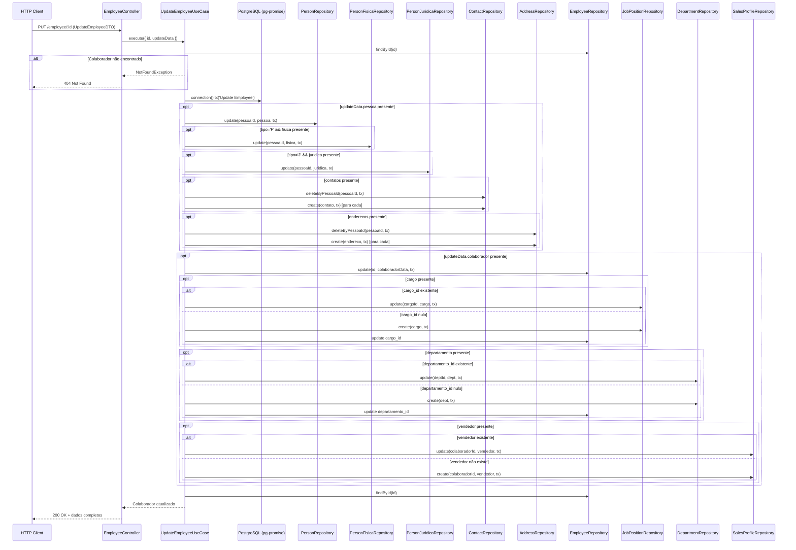

# Design Document

## Overview

Este documento descreve o design técnico para a funcionalidade de atualização de colaborador (update-employee) no módulo de pessoas do ERP modular. A implementação segue o padrão transacional já estabelecido pelo `UpdateClientUseCase`, adaptado para as particularidades do módulo de colaborador que inclui entidades adicionais como cargo, departamento e perfil de vendedor.

A solução utiliza a arquitetura em camadas do NestJS (Controller → UseCase → Repository) com pg-promise para gerenciamento de transações atômicas no PostgreSQL. Todas as operações de escrita são encapsuladas em uma única transação, garantindo consistência dos dados mesmo em cenários de falha parcial.

## Architecture



### Decisões Arquiteturais

1. **Padrão transacional idêntico ao UpdateClientUseCase**: Reutiliza o mesmo fluxo de `connection().tx()` para garantir atomicidade.
2. **Estratégia de substituição para contatos/endereços**: Delete-all + re-create dentro da transação (mesmo padrão do client).
3. **Upsert condicional para cargo/departamento/vendedor**: Verifica existência antes de decidir entre create ou update.
4. **Consulta pós-commit**: Retorna dados completos via `findById` após a transação, garantindo leitura consistente.

## Components and Interfaces

### UpdateEmployeeUseCase

Classe principal que orquestra a lógica de atualização. Implementa `BaseUseCase<{ id: string; updateData: UpdateEmployeeDTO }, any>`.

```typescript
export class UpdateEmployeeUseCase implements BaseUseCase<any, any> {
  constructor(
    @Inject('DATABASE_CONNECTION') private readonly connection: any,
    @Inject('IPersonRepository') private readonly personRepository: IPersonRepository,
    @Inject('IPersonFisicaRepository') private readonly personFisicaRepository: IPersonFisicaRepository,
    @Inject('IPersonJuridicaRepository') private readonly personJuridicaRepository: IPersonJuridicaRepository,
    @Inject('IContactRepository') private readonly contactRepository: IContactRepository,
    @Inject('IAddressRepository') private readonly addressRepository: IAddressRepository,
    @Inject('IEmployeeRepository') private readonly employeeRepository: IEmployeeRepository,
    @Inject('IJobPositionRepository') private readonly jobPositionRepository: IJobPositionRepository,
    @Inject('IDepartmentRepository') private readonly departmentRepository: IDepartmentRepository,
    @Inject('ISalesProfileRepository') private readonly salesProfileRepository: ISalesProfileRepository,
  ) {}

  async execute(data: { id: string; updateData: UpdateEmployeeDTO }): Promise<any>;
}
```

### Interfaces de Repositório (métodos novos)

#### IEmployeeRepository (adição do método update)

```typescript
export interface IEmployeeRepository {
  create(data: any, transaction?: any): Promise<Employee>;
  findById(id: string): Promise<any>;
  findAll(page: number, limit: number): Promise<{ data: any[]; total: number }>;
  update(id: string, data: any, transaction?: any): Promise<any>;  // NOVO
}
```

#### IJobPositionRepository (adição do método update)

```typescript
export interface IJobPositionRepository {
  create(data: any, transaction?: any): Promise<any>;
  update(id: string, data: any, transaction?: any): Promise<any>;  // NOVO
}
```

#### IDepartmentRepository (adição do método update)

```typescript
export interface IDepartmentRepository {
  create(data: any, transaction?: any): Promise<any>;
  update(id: string, data: any, transaction?: any): Promise<any>;  // NOVO
}
```

#### ISalesProfileRepository (interface nova)

```typescript
export interface ISalesProfileRepository {
  create(data: any, transaction?: any): Promise<any>;
  update(colaboradorId: string, data: any, transaction?: any): Promise<any>;
  findByColaboradorId(colaboradorId: string, transaction?: any): Promise<any | null>;
}
```

### UpdateEmployeeDTO

```typescript
export class UpdateEmployeeDTO {
  pessoa?: {
    nome?: string;
    email?: string;
    observacao?: string;
    tipo: 'F' | 'J';
    fisica?: FisicaDTO;
    juridica?: JuridicaDTO;
    contatos?: ContactDTO[];
    enderecos?: AddressDTO[];
  };

  colaborador?: {
    matricula?: string;
    dataAdmissao?: Date;
    dataDemissao?: Date;
    cargo?: {
      nome: string;
      salario: number;
    };
    departamento?: {
      nome: string;
    };
    vendedor?: {
      comissao: number;
      metaVendas: number;
    };
  };
}
```

### EmployeeController (endpoint novo)

```typescript
@Put(':id')
updateEmployee(
  @Param('id') id: string,
  @Body() updateEmployeeDto: UpdateEmployeeDTO
) {
  return this.updateEmployeeUseCase.execute({ id, updateData: updateEmployeeDto });
}
```

## Data Models

### Tabelas envolvidas

| Tabela | Operação | Condição |
|--------|----------|----------|
| `pessoa` | UPDATE (COALESCE) | `updateData.pessoa` presente |
| `pessoa_fisica` | UPDATE | `pessoa.tipo = 'F'` e `pessoa.fisica` presente |
| `pessoa_juridica` | UPDATE | `pessoa.tipo = 'J'` e `pessoa.juridica` presente |
| `pessoa_contato` | DELETE ALL + INSERT | `pessoa.contatos` presente |
| `pessoa_endereco` | DELETE ALL + INSERT | `pessoa.enderecos` presente |
| `colaborador` | UPDATE (matricula, cargo_id, departamento_id) | `updateData.colaborador` presente |
| `cargo` | UPDATE ou INSERT | `colaborador.cargo` presente |
| `departamento` | UPDATE ou INSERT | `colaborador.departamento` presente |
| `vendedor` | UPDATE ou INSERT | `colaborador.vendedor` presente |

### Queries SQL principais

**Atualização do colaborador:**
```sql
UPDATE colaborador
SET matricula = COALESCE($2, matricula),
    cargo_id = COALESCE($3, cargo_id),
    departamento_id = COALESCE($4, departamento_id)
WHERE id = $1
RETURNING *
```

**Atualização do cargo:**
```sql
UPDATE cargo
SET nome = COALESCE($2, nome),
    salario = COALESCE($3, salario)
WHERE id = $1
RETURNING *
```

**Atualização do departamento:**
```sql
UPDATE departamento
SET nome = COALESCE($2, nome)
WHERE id = $1
RETURNING *
```

**Upsert do vendedor (update):**
```sql
UPDATE vendedor
SET comissao = COALESCE($2, comissao),
    meta_venda = COALESCE($3, meta_venda)
WHERE colaborador_id = $1
RETURNING *
```

**Upsert do vendedor (create):**
```sql
INSERT INTO vendedor (colaborador_id, comissao, meta_venda)
VALUES ($1, $2, $3)
RETURNING *
```


## Correctness Properties

*A property is a characteristic or behavior that should hold true across all valid executions of a system-essentially, a formal statement about what the system should do. Properties serve as the bridge between human-readable specifications and machine-verifiable correctness guarantees.*

### Property 1: Despacho condicional de operações baseado na estrutura do DTO

*For any* UpdateEmployeeDTO válido e qualquer estado inicial de colaborador, o conjunto de operações de repositório executadas pelo UseCase deve corresponder exatamente aos campos presentes no DTO: se `pessoa` está presente, `personRepository.update` é chamado; se `pessoa` está ausente, nenhuma operação de pessoa é executada. Se `colaborador` está presente, `employeeRepository.update` é chamado; se ausente, nenhuma operação de colaborador é executada.

**Validates: Requirements 4.1, 4.4, 7.1, 7.4, 9.3**

### Property 2: Semântica de substituição de arrays (contatos e endereços)

*For any* UpdateEmployeeDTO onde `pessoa.contatos` ou `pessoa.enderecos` está definido (incluindo array vazio), o sistema deve executar a remoção completa dos registros existentes seguida da criação dos novos itens fornecidos. Quando o campo está `undefined`, nenhuma operação de remoção ou criação deve ocorrer.

**Validates: Requirements 5.1, 5.2, 5.3, 6.1, 6.2, 6.3**

### Property 3: Lógica de upsert para cargo, departamento e vendedor

*For any* UpdateEmployeeDTO com `colaborador.cargo`, `colaborador.departamento` ou `colaborador.vendedor` presente, e qualquer estado inicial do colaborador (com ou sem entidades vinculadas): se a entidade já existe (ID não nulo), o sistema deve chamar update; se a entidade não existe (ID nulo), o sistema deve chamar create e vincular o novo ID ao colaborador.

**Validates: Requirements 7.2, 7.3, 7.5, 7.6, 8.1, 8.2**

### Property 4: Validação do DTO rejeita dados inválidos

*For any* objeto de entrada que viola as regras de validação do UpdateEmployeeDTO (nome > 150 caracteres, email > 200 caracteres, matricula > 20 caracteres, comissao fora de [0, 100], metaVendas fora de [0.01, 999999999.99], salario fora de [0.01, 999999.99], tipo diferente de 'F'/'J'), o sistema deve rejeitar a requisição antes de iniciar qualquer operação de banco de dados.

**Validates: Requirements 4.7, 8.4, 9.1, 9.2, 9.5**

### Property 5: Exclusão mútua entre pessoa física e jurídica

*For any* UpdateEmployeeDTO onde `pessoa.tipo` é 'F', o campo `pessoa.juridica` deve ser rejeitado se presente; e onde `pessoa.tipo` é 'J', o campo `pessoa.fisica` deve ser rejeitado se presente. Apenas o sub-objeto correspondente ao tipo é aceito.

**Validates: Requirements 4.2, 4.3, 4.6, 9.4**

## Error Handling

### Estratégia de Tratamento de Erros

| Cenário | Exceção | HTTP Status | Mensagem |
|---------|---------|-------------|----------|
| Colaborador não encontrado | `NotFoundException` | 404 | "Colaborador não encontrado" |
| ID inválido (nulo/vazio/formato) | `BadRequestException` | 400 | "ID inválido" |
| Validação do DTO falha | `BadRequestException` | 400 | Detalhes dos campos inválidos |
| Matrícula duplicada | `ConflictException` | 409 | "Matrícula já está em uso" |
| Falha na transação (DB) | `InternalServerErrorException` | 500 | "Erro interno ao atualizar colaborador" |
| findById retorna null pós-commit | `NotFoundException` | 404 | "Colaborador não encontrado após atualização" |

### Fluxo de Erros na Transação

1. **Pré-transação**: Validação do DTO e verificação de existência do colaborador. Erros aqui não iniciam transação.
2. **Durante transação**: Qualquer exceção causa rollback automático via pg-promise `tx()`. A exceção é propagada para o controller.
3. **Pós-transação**: Se `findById` retorna null (cenário improvável), lança `NotFoundException`.

### Logging

Seguindo o padrão do `CreateEmployeeUseCase`, erros devem ser logados via `console.log` antes de serem propagados. Em caso de sucesso, não há log adicional (diferente do create que loga o resultado).

## Testing Strategy

### Abordagem de Testes

A estratégia combina testes unitários para cenários específicos e testes baseados em propriedades para validar comportamentos universais da lógica de orquestração.

### Testes Unitários (Jest)

| Cenário | Tipo | Descrição |
|---------|------|-----------|
| Colaborador não encontrado | Example | Mock findById retornando null, verificar NotFoundException |
| Atualização com sucesso (todos os campos) | Example | Mock completo, verificar chamadas de repositório |
| Atualização parcial (apenas pessoa) | Example | Verificar que repos de colaborador não são chamados |
| Atualização parcial (apenas colaborador) | Example | Verificar que repos de pessoa não são chamados |
| Matrícula duplicada | Edge Case | Mock de erro de constraint unique |
| ID vazio/nulo | Edge Case | Verificar exceção de validação |
| findById null pós-commit | Edge Case | Verificar NotFoundException |
| Controller retorna 200 | Example | Mock use case com sucesso |
| Controller retorna 404 | Example | Mock use case com NotFoundException |
| Controller retorna 400 | Edge Case | Corpo inválido |

### Testes Baseados em Propriedades (fast-check)

Biblioteca escolhida: **fast-check** (já compatível com Jest no ecossistema Node.js/TypeScript)

Configuração: mínimo de **100 iterações** por propriedade.

| Property | Tag | Descrição |
|----------|-----|-----------|
| Property 1 | `Feature: update-employee, Property 1: Conditional operation dispatch` | Gera DTOs aleatórios e verifica que as operações executadas correspondem aos campos presentes |
| Property 2 | `Feature: update-employee, Property 2: Array replacement semantics` | Gera arrays de contatos/endereços (incluindo vazio e undefined) e verifica semântica de substituição |
| Property 3 | `Feature: update-employee, Property 3: Upsert logic for sub-entities` | Gera estados iniciais (com/sem cargo/dept/vendedor) e DTOs, verifica create vs update |
| Property 4 | `Feature: update-employee, Property 4: DTO validation rejects invalid data` | Gera dados inválidos (strings longas, números fora de range) e verifica rejeição |
| Property 5 | `Feature: update-employee, Property 5: Tipo/Fisica/Juridica mutual exclusion` | Gera DTOs com combinações inválidas de tipo+fisica/juridica e verifica rejeição |

### Testes de Integração

| Cenário | Descrição |
|---------|-----------|
| Transação completa com commit | Verificar que todas as tabelas são atualizadas atomicamente |
| Rollback em falha | Forçar erro e verificar que nenhuma alteração persiste |
| Módulo NestJS carrega sem erros | Verificar resolução de dependências |

### Estrutura de Arquivos de Teste

```
src/modules/person/employee/tests/
├── update-employee.use-case.spec.ts          # Testes unitários do use case
├── update-employee.use-case.property.spec.ts # Testes de propriedade (fast-check)
├── update-employee.dto.spec.ts               # Testes de validação do DTO
└── update-employee.controller.spec.ts        # Testes do controller
```
